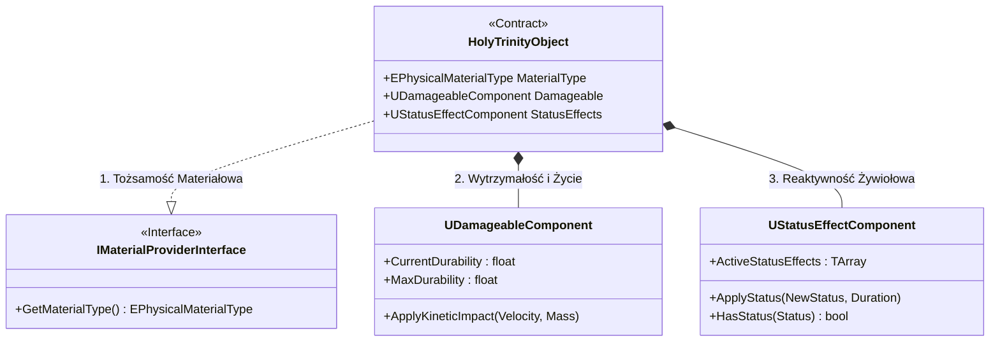
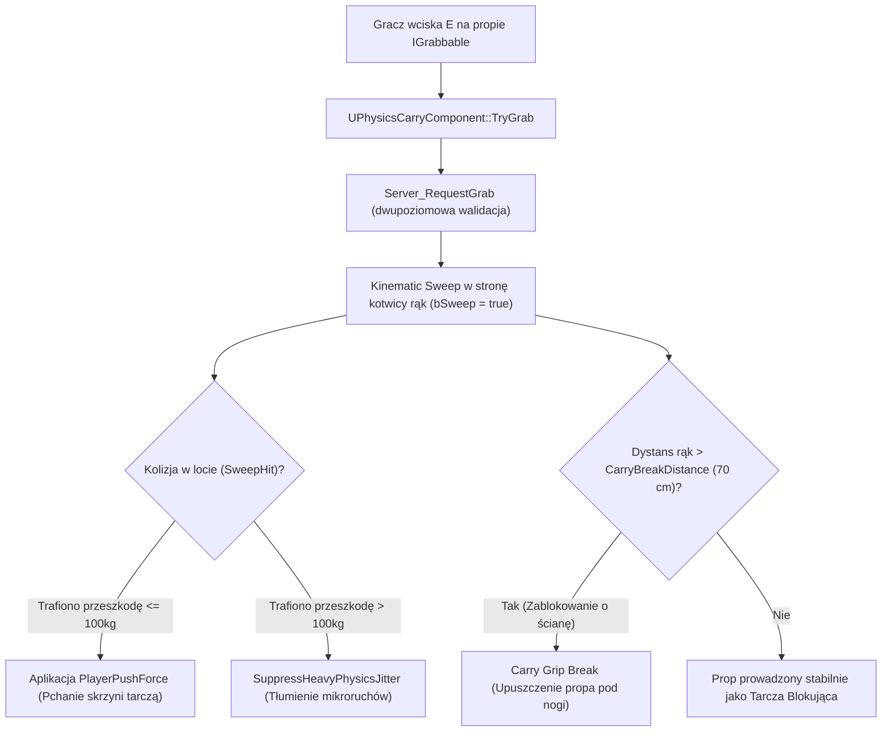

# Architektura Systemowa i Standardy Projektowe: Dungeon Crawler Co-op

Dokument stanowi **centralny i nadrzędny dokument architektoniczny projektu** *Dungeon Crawler* (Unreal Engine 5.8 C++, `MYPROJECT_API`).
Definiuje wzorce inżynierii oprogramowania, modularność domeny, prawa fizyki i kinetyki, silnik chemii żywiołów, autorytatywną warstwę sieciową Co-op (1–6 graczy) oraz specyfikację struktur lochu zgodną z [THEME_PARK_SPECIFICATION.md](file:///E:/UE_PROJECTS/MyProject/.context/THEME_PARK_SPECIFICATION.md) i [CORE_COOP_PRINCIPLES.md](file:///E:/UE_PROJECTS/MyProject/.context/CORE_COOP_PRINCIPLES.md).

---

## 1. Paradygmat Architektoniczny (Java/Spring & Clean Architecture Standards)

Projekt implementuje rygorystyczne wzorce czystego kodu inspirowane wzorcami backendowymi (Java/Spring Boot, Event-Driven Architecture, REST/RPC):

* **Single Responsibility Principle (Kompozycja ponad Dziedziczenie):**
  * Klasy `AActor` oraz `ACharacter` pełnią wyłącznie rolę punktów styku / orkiestratorów (odpowiednik `@RestController`).
  * Wszelka logika domenowa (integralność fizyczna, chemia żywiołów, interakcje, noszenie obiektów Chaos, mechanizmy) jest hermetyzowana w dedykowanych komponentach `UActorComponent` (odpowiednik `@Service`).
* **Dependency Inversion & Loose Coupling (Architektura Interfejsowa):**
  * Komunikacja międzydomenowa i manipulacja obiektami w świecie gry odbywa się **wyłącznie za pośrednictwem interfejsów `UInterface` / `IInterface`**.
  * Całkowity zakaz twardego rzutowania (`Cast<T>`) w kodzie domenowym.
  * Kluczowe kontrakty projektu:
    - [`IMaterialProviderInterface`](file:///E:/UE_PROJECTS/MyProject/Source/MyProject/Shared/Interfaces/MaterialProviderInterface.h) – tożsamość materiałowa (`Stone`, `Wood`, `Metal`, `Glass`, `Flesh`).
    - [`IInteractableInterface`](file:///E:/UE_PROJECTS/MyProject/Source/MyProject/Shared/Interfaces/IInteractableInterface.h) – obsługa logicznej interakcji klawiszem `E` (dźwignie, włączniki) z opcjonalnym czasem przytrzymania (Hold/Channeling).
    - [`IGrabbableInterface`](file:///E:/UE_PROJECTS/MyProject/Source/MyProject/Shared/Interfaces/IGrabbableInterface.h) – kontrakt fizycznej manipulacji propami (chwyt, pęd rzutu, upuszczenie).
    - [`IMechanismReceiverInterface`](file:///E:/UE_PROJECTS/MyProject/Source/MyProject/Shared/Interfaces/MechanismReceiverInterface.h) – odbiór sygnałów logicznych ON/OFF z przełączników i płyt naciskowych.
    - [`ICarryAnchorProviderInterface`](file:///E:/UE_PROJECTS/MyProject/Source/MyProject/Shared/Interfaces/CarryAnchorProviderInterface.h) – odseparowanie logiki trzymania propa od konkretnej klasy postaci.
    - [`IStatProviderInterface`](file:///E:/UE_PROJECTS/MyProject/Source/MyProject/Shared/Interfaces/StatProviderInterface.h) – ujednolicone zapytania o stan HP/durability dla UI.
* **Architektura Sterowana Zdarzeniami (Event-Driven Architecture):**
  * Komunikacja komponent -> UI / Prezentacja / Efekty VFX realizowana jest przez dynamiczne delegaty multicastowe (`DECLARE_DYNAMIC_MULTICAST_DELEGATE`).
* **Ścisła Separacja Domeny od Prezentacji (MVC / Layered Pattern):**
  * **C++ (Backend / Domena):** Czysta logika biznesowa, matematyka kinetyczna, autorytatywny kod sieciowy, ewaluacja chemiczna, struktury `USTRUCT`, komponenty i interfejsy.
  * **Blueprints (Frontend / Widok / Prefaby):** Wyłącznie klasy pochodne służące do spinania assetów wizualnych (Static Meshe, animacje, materiały, dźwięki, widgety). Obowiązuje zakaz programowania logiki biznesowej w Blueprintach.
* **Data-Driven Configuration:**
  * Parametry fizyczne, mnożniki i progi definiowane są w strukturach konfiguracyjnych (`UPROPERTY(EditDefaultsOnly)` – np. `FCarrySocketConfig`), eliminując Magic Numbers i sztywne stałe.

---

## 2. Mapa Architektury Kodu (`Source/MyProject/`)

```text
Source/MyProject/
├── Logging/                                         <-- Dedykowana telemetria i kategorie logowania
│   └── DungeonLogCategories.h/.cpp                  (LogDungeonInteraction, LogDungeonPhysics, LogDungeonNetwork, LogDungeonMechanisms, LogDungeonElements)
│
├── Networking/                                      <-- Warstwa autorytatywna Co-op (1–6 graczy)
│   └── NetworkFunctionLibrary.h/.cpp                (Makra REQUIRE_AUTHORITY, ConfigurePhysicsReplication, AttachCarriedProp, DetachCarriedProp)
│
├── Dungeon/                                         <-- Świat lochu, struktury i mechanizmy
│   ├── Structure/
│   │   └── DungeonStructureBase.h/.cpp              (Modularne ściany/podłogi, Punch-Through, niszczalność, replikacja)
│   ├── Props/
│   │   ├── InteractivePropBase/                     (Fizyczne rekwizyty Chaos, kwantyzacja transformu, transfer kinetyczny)
│   │   ├── VolatileProp/                            (Niestabilne obiekty alchemiczne, wybuchy autorytatywne, NetMulticast FX)
│   │   ├── SwitchPropBase/                          (Abstrakcyjny przełącznik/aktywator logiczny, bAllowSwitchBack, TargetMechanisms)
│   │   ├── SimpleSwitchProp/                        (Dźwignia/przełącznik ścienny z IInteractableInterface)
│   │   └── PressurePlateProp/                       (Fizyczna płyta naciskowa sumująca rzeczywistą masę ciał >= 50 kg)
│   └── Mechanisms/
│       ├── MechanismTrapBase/                       (Abstrakcyjna baza pułapek z pętlą czasową bIsContinuousLoop i IMechanismReceiver)
│       └── PistonTrap/                              (Kamienny taran/tłok ścienny/podłogowy, maszyna stanów EPistonState, Zero-Tick)
│
├── Environment/                                     <-- Fizyka, kinetyka i żywioły
│   ├── Kinetic/
│   │   ├── Components/KnockbackComponent/           (Aplikowanie odrzutów dla postaci i impulsów dla ciał sztywnych)
│   │   ├── Utilities/KineticForceLibrary            (Radialne eksplozje, wiry kinetyczne, pchanie TryApplyPhysicsPush, tłumienie SuppressHeavyPhysicsJitter)
│   │   └── Enums/KineticEnums.h                     (EKnockbackFalloff)
│   └── Elements/
│       ├── Data/StatusEffectDefinitions.h           (Centralny rejestr FStatusEffectRegistry, parametry DoT i reakcji)
│       ├── Enums/ElementEnums.h                     (EStatusEffectType: None, Burning, Wet, Electrified, Oiled)
│       ├── StatusZone/ElementalStatusZone           (Autonomiczne strefy rozlewisk/kałuż/ognia, LoS, wygaszanie konfliktów cieczy)
│       └── Utilities/
│           ├── ElementalChemistryLibrary            (Silnik reakcji chemicznych i kompatybilności materiałowej)
│           └── ElementalDeliveryLibrary             (Point Hit, Surface Splash, Radial Burst z LoS, Status Zone)
│
├── Shared/                                          <-- Współdzielone serwisy, komponenty i kontrakty
│   ├── Components/
│   │   ├── DamageableComponent/                     (Replikowane durability/HP, Server-Authoritative, kinetic debounce)
│   │   ├── InteractionComponent/                    (Wykrywanie wzrokiem Sphere/Line Trace, akcje IInteractable, Hold/Channeling 5s)
│   │   ├── PhysicsCarryComponent/                   (Manipulacja i rzuty Chaos, Kinematic Sweep Follow, ECarryState, FCarrySocketConfig)
│   │   └── StatusEffectComponent/                   (Replikowany zarządca statusów, Zero-Bandwidth Timers, Elemental Priority Pipeline)
│   ├── Interfaces/
│   │   ├── CarryAnchorProviderInterface.h           (Kontrakt kotwicy rąk i limitów pchania dla postaci niosącej)
│   │   ├── IGrabbableInterface.h                    (Kontrakt chwytania i rzucania fizycznymi propami)
│   │   ├── IInteractableInterface.h                 (Kontrakt interakcji logicznych)
│   │   ├── MaterialProviderInterface.h              (Zapytanie o tożsamość materiałową EPhysicalMaterialType)
│   │   ├── MechanismReceiverInterface.h             (Kontrakt odbiornika sygnałów aktywatorów SetMechanismState)
│   │   └── StatProviderInterface.h                  (Kontrakt na odczyt wskaźników HP/durability)
│   └── Enums/
│       └── PhysicalMaterialEnums.h                  (EPhysicalMaterialType: Stone, Wood, Metal, Glass, Flesh)
│
├── Player/                                          <-- Postać gracza i sterowanie
│   ├── Components/PlayerCameraComponent/            (Płynny zoom TPP/Top-Down, On-Demand Tick)
│   ├── PlayerCharacter.h/.cpp                       (Kinematyczna postać CMC, Flesh, MoveBlockedBy fizyczne pchanie, orkiestrator wejścia E/R)
│   └── PlayerCharacterController.h/.cpp
│
└── UI/                                              <-- Warstwa prezentacji stanu gry
    ├── PlayerHUD/                                   (Aktor HUD orkiestrujący widgety)
    ├── PlayerHUDWidget/                             (Główny widok: pasek zdrowia + kontener statusów)
    ├── StatusIconWidget/                            (Dynamiczna kontrolka ikony statusu z radialnym timerem)
    └── StatBarWidget.h/.cpp                         (Wskaźnik paskowy HP/durability)
```

---

## 3. Żelazna Zasada Ekosystemu: Święta Trójca Propów i Struktur

Zgodnie ze specyfikacją [THEME_PARK_SPECIFICATION.md](file:///E:/UE_PROJECTS/MyProject/.context/THEME_PARK_SPECIFICATION.md), **żaden interaktywny ani fizyczny obiekt w świecie gry nie może być "pustym Static Meshem"**. Wszystkie elementy (propy, struktury, pułapki, barykady) bezwzględnie implementują **Świętą Trójcę**:



1. **Tożsamość Materiałowa ([`IMaterialProviderInterface`](file:///E:/UE_PROJECTS/MyProject/Source/MyProject/Shared/Interfaces/MaterialProviderInterface.h)):**
   - Określa naturę fizyczną obiektu: `Stone`, `Wood`, `Metal`, `Glass`, `Flesh`.
   - Determinuje reakcje żywiołowe (np. kamień i metal odrzucają ogień, drewno płonie, szkło jest kruche).
2. **Wytrzymałość i Życie ([`UDamageableComponent`](file:///E:/UE_PROJECTS/MyProject/Source/MyProject/Shared/Components/DamageableComponent/DamageableComponent.h)):**
   - Autorytatywne punkty wytrzymałości (`CurrentDurability`, `MaxDurability`).
   - Kinetyczne obrażenia od prędkości kolizji (`ApplyKineticImpact`) z debouncem przeciw wielokrotnym trafieniom (`KineticImpactCooldown = 0.25s`).
3. **Reaktywność Żywiołowa ([`UStatusEffectComponent`](file:///E:/UE_PROJECTS/MyProject/Source/MyProject/Shared/Components/StatusEffectComponent/StatusEffectComponent.h)):**
   - Obsługa powłok (`Wet`, `Oiled`, `Burning`, `Electrified`).
   - Autorytatywne DoT, reakcje chemiczne i zoptymalizowana sieć *Zero-Bandwidth Timers*.

---

## 4. Architektura Postaci, Kinetyki i Trzymania Obiektów

### 4.1. Kinematyczna Postać Gracza ([`APlayerCharacter`](file:///E:/UE_PROJECTS/MyProject/Source/MyProject/Player/PlayerCharacter.h))
- Oparta na stabilnym, sieciowym `CharacterMovementComponent` (CMC) z wyłączonym zbędnym tickiem (`bCanEverTick = false`).
- Postać nie symuluje fizyki jako Rigid Body w Chaosie, co eliminuje wystrzeliwanie postaci przy kolizjach ze skrzyniami i podłożem.
- **Fizyczne Pchanie Ciałem (`MoveBlockedBy`):**
  - Wydelegowane do [`UKineticForceLibrary::TryApplyPhysicsPush`](file:///E:/UE_PROJECTS/MyProject/Source/MyProject/Environment/Kinetic/Utilities/KineticForceLibrary.h).
  - Gracz posiada zdefiniowaną masę wirtualną ($100\text{ kg}$) i siłę naporu ($150\,000\text{ N}$).
  - Kolizja z propem $\le 100\text{ kg}$ przekazuje wektorową siłę pchania, pozwalając na toczenie głazów i przepychanie skrzyń.
  - Kolizja z propem $> 100\text{ kg}$ traktowana jest jak solidna ściana.

### 4.2. Wzorzec Kinematycznego Prowadzenia Propów ([`UPhysicsCarryComponent`](file:///E:/UE_PROJECTS/MyProject/Source/MyProject/Shared/Components/PhysicsCarryComponent/PhysicsCarryComponent.h))
Całkowicie odrzucono sztywny `AttachToComponent` oraz niestabilny w sieci `PhysicsHandleComponent`:



- **Rola Tarczy (Blocking Shield):** Trzymana deska lub głaz blokuje lecące pociski (`ECC_WorldDynamic`), magię i uderzenia wrogów, pochłaniając energię i chroniąc gracza.
- **Decoupling przez Interfejs:** Komponent noszenia nie zależy od konkretnej klasy postaci, lecz od lekkiego interfejsu [`ICarryAnchorProviderInterface`](file:///E:/UE_PROJECTS/MyProject/Source/MyProject/Shared/Interfaces/CarryAnchorProviderInterface.h).
- **Rzut Zamachem Myszką (Camera Angular Swing Throw) i Pure Drop (Klawisz E):**
  - Wciśnięcie `E` w spoczynku upuszcza prop pod nogi z zerową prędkością (czysty spadek grawitacyjny).
  - Dynamiczny obrót kamerą (zamach myszą) wylicza prędkość kątową na ramieniu trzymania i nadaje pęd po łuku zamachu.
- **Dedykowany Rzut na wprost (Klawisz R / LPM):**
  - Autorytatywny rzut w kierunku celownika (`ThrowImpulseStrength = 1400`) z uwzględnieniem prędkości biegu postaci.

---

## 5. Silnik Żywiołów, Chemii i Dystrybucji (Elemental Engine)

### 5.1. Hierarchia Reakcji Chemii (Elemental Priority Pipeline)
Podczas aplikacji statusu przez [`UStatusEffectComponent`](file:///E:/UE_PROJECTS/MyProject/Source/MyProject/Shared/Components/StatusEffectComponent/StatusEffectComponent.h) zachodzi dwufazowa ewaluacja logiczna:
1. **Faza 1 (Żywioł vs Aktywna Powłoka):**
   - Jeśli cel ma aktywny status (np. `Wet`), a przychodzi ogień (`Burning`), wyzwalana jest reakcja `Steam_Extinguish`. Woda odparowuje, ogień zostaje ugaszony (`bConsumeIncomingStatus = true`), nie dotykając materiału pod spodem.
   - Jeśli cel jest `Oiled`, a przychodzi `Burning` $\rightarrow$ gwałtowna detonacja `Oil_Ignition`.
   - Jeśli cel jest `Wet`, a przychodzi `Electrified` $\rightarrow$ natychmiastowe porażenie przewodzące `Conductive_Shock`.
2. **Faza 2 (Żywioł vs Tożsamość Materiałowa):**
   - Dopiero gdy żywioł nie zostanie zneutralizowany przez powłokę, silnik sprawdza [`UElementalChemistryLibrary::CanMaterialReceiveStatus`](file:///E:/UE_PROJECTS/MyProject/Source/MyProject/Environment/Elements/Utilities/ElementalChemistryLibrary.h). Kamień i metal odrzucają ogień, uniemożliwiając ich zapalenie.

### 5.2. Architektura Dystrybucji Żywiołów ([`UElementalDeliveryLibrary`](file:///E:/UE_PROJECTS/MyProject/Source/MyProject/Environment/Elements/Utilities/ElementalDeliveryLibrary.h))
Silnik obsługuje 4 fundamentalne archetypy dostarczania:
1. **Point Hit:** Punktowe uderzenie pojedynczym pociskiem w 1 aktora.
2. **Surface Splash:** Rozbryzg na powierzchni (np. stłuczenie flakonu oliwy/wody).
3. **Radial Burst (z Line of Sight):** Radialna eksplozja sprawdzająca przeszkody geometryczne.
4. **Status Zone:** Trwałe strefy naziemne (kałuże, pożary) z ochroną przed nakładaniem sprzecznych żywiołów.
