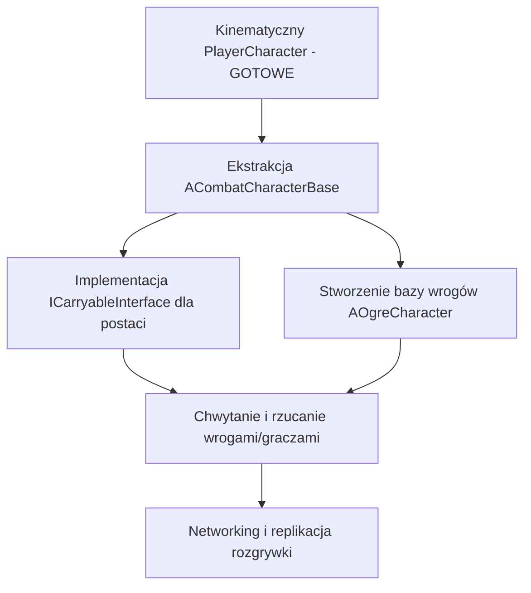

# Plan architektoniczny & Stan Projektu: Kinematyczny Character Controller + Fizyczne Propy (Dungeon Crawler 4-player co-op)

## 1. Kontekst projektu

- **Silnik:** Unreal Engine 5.8, C++ (`MYPROJECT_API`)
- **Gatunek:** 4-osobowy kooperacyjny dungeon crawler
- **Filozofia fizyki:** Zamiast niekontrolowanej pełnej symulacji fizyki ciał sztywnych na postaciach, stosujemy **deterministyczny, kinematyczny model ruchu postaci** z manualnym przekazywaniem sił i impulsów do obiektów otoczenia (propy, zniszczalne elementy, odrzuty, rzuty).
- **Stan obecny:** Zakończono etap stabilizacji i czyszczenia kinematycznego kontrolera gracza (`APlayerCharacter`) oraz interakcji z propami fizycznymi.

---

## 2. Zrealizowane Filary Architektoniczne

### Filar 1: Kinematyczny Ruch Gracza (`APlayerCharacter`)
- **Brak symulacji fizyki na kapsule:** `CapsuleComponent->SetSimulatePhysics(false)` – brak niekontrolowanych sił depenetracji Chaosu.
- **Ruch iteracyjny (Flat Iterative Slide):** 3-iteracyjny płaski algorytm rzutowania wektora prędkości (`VectorPlaneProject`) wzdłuż płaszczyzn kolizji wielościennych/narożników.
- **On-Demand Tick:** Postać w spoczynku na ziemi wyłącza swój `Tick` (0ms narzutu CPU).
- **Zintegrowany Odrzut (Unified Knockback System):** `ApplyKnockback(Impulse)` obsługuje podmuchy wiatru, ciosy wroga i rzuty. Wykrywa mocne uderzenia w ściany i aplikuje obrażenia kinetyczne przez `UDamageableComponent`.
- **Śledzenie ruchomych platform (Base Tracking):** Postać płynnie przemieszcza się i obraca wraz z ruchomą geometrią/windami/platformami pod jej stopami.

### Filar 2: Dynamiczne Pchanie Propów Fizycznych
- Propy o masie $\le 100\text{ kg}$ otrzymują liniowy impuls w środek masy przy kontakcie z kapsułą w ruchu.
- Siła pchania skaluje się w zależności od masy propa (płynna różnica w trudności pchania między 20 kg a 100 kg).
- **Zabezpieczenie przed pętlą perpetuum mobile:** Zablokowano pchanie obiektu, na którym postać w danej chwili stabilnie stoi obiema stopami.

### Filar 3: Geometria i Kolizja Propów (Chaos Physics)
- Propy (`SM_Prop_Cube`) posiadają sfazowane krawędzie (Bevel 10 cm).
- Kolizja propów wykorzystuje **`NDOP26` (26-sided chamfered collision)** w trybie `CTF_USE_DEFAULT`, co zapewnia gładkie zsuwanie się kapsuły po narożnikach przy zachowaniu pełnej symulacji fizyki ciał sztywnych w Chaosie.

---

## 3. Kolejne Kroki i Priorytety

1. **Ekstrakcja `ACombatCharacterBase`:**
   * Wydzielenie wspólnej kinematyki ruchu, obsługi `PerformGroundCheck`, `PerformMovement`, `ApplyKnockback`, `UDamageableComponent` i `UInteractionComponent` z `APlayerCharacter` do klasy bazowej `ACombatCharacterBase`.
2. **Implementacja `ICarryableInterface`:**
   * Umożliwienie podnoszenia, noszenia na barku (`AttachToComponent`) i rzucania postaciami (gracze/wrogowie) przez `UInteractionComponent` z wykorzystaniem `ApplyKnockback`.
3. **Stworzenie sztucznej inteligencji (`AOgreCharacter`):**
   * Oparty na `ACombatCharacterBase`, wykorzystujący spójny model obrażeń kinetycznych, odrzutu i interakcji z otoczeniem.
4. **Networking (w dalszej kolejności):**
   * Replikacja propów (`PredictiveInterpolation`), Server RPC dla chwytania/rzucania oraz predykcja ruchu gracza.
