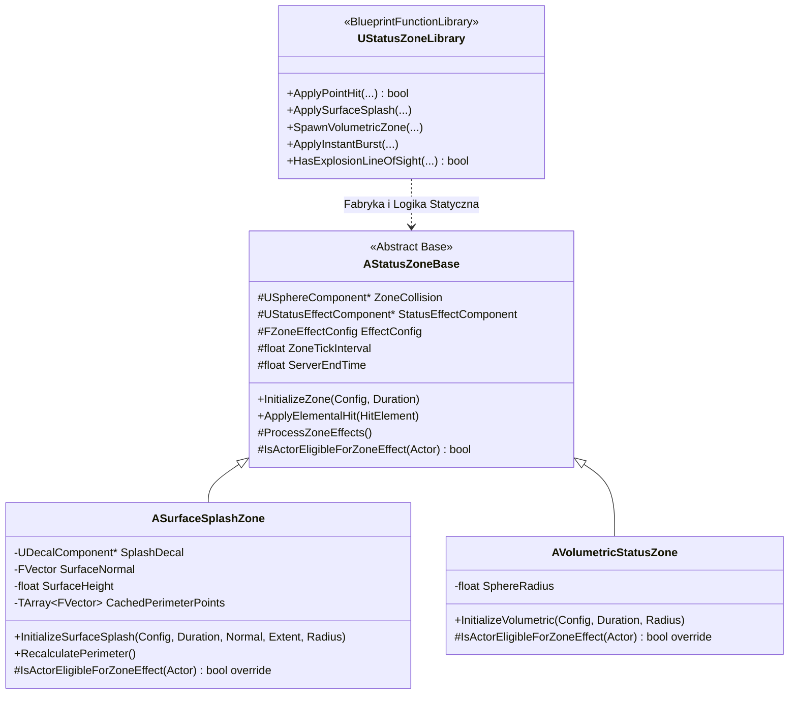
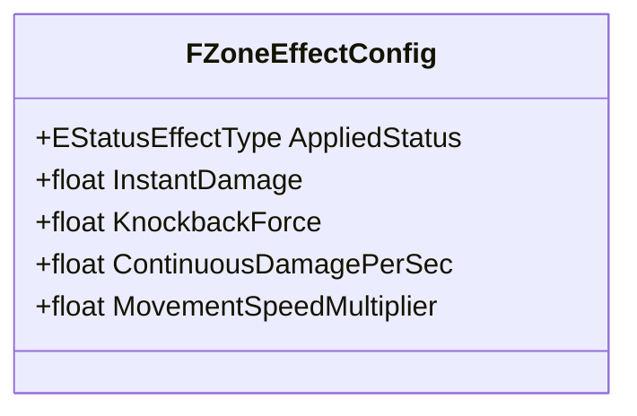
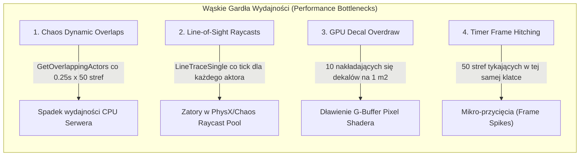

# Specyfikacja Techniczna i Projektowa: System Stref Statusów (Status Zone System)

Dokument stanowi **kompletną kartę projektowo-architektoniczną** dla modułu stref (`Status Zones`) w projekcie *Dungeon Crawler Co-op* (Unreal Engine 5.8 C++, `MYPROJECT_API`).
Definiuje zrealizowaną transformację monolitycznego aktora w **uniwersalny, modułowy system hierarchii klas C++**, rejestruje rozwiązane problemy fizyczno-geometryczne oraz przedstawia **krytyczny audyt wydajności i skalowalności** w warunkach intensywnej rozgrywki kooperacyjnej (1–6 graczy, roje wrogów, dziesiątki nakładających się stref).

---

## 1. Wizja i Cele Nowego Systemu

Dotychczasowy aktor `AElementalStatusZone` był ściśle powiązany z wąskim pojęciem żywiołów (kałuże wody, plamy oleju, ogień) i posiadał sztywno zakodowane parametry (np. `LiquidSurfaceHeight = 35.0f`, `FireSurfaceHeight = 85.0f`).

Nowy system **Status Zone** realizuje następujące filary:
1. **Uniwersalność Domenowa:**
   Strefa reprezentuje dowolny obszar oddziaływania na gameplay w lochu:
   - **Żywioły i Ciecze:** Ogień, plama oleju, rozlana woda, kwas.
   - **Gazy i Zjawiska Środowiskowe:** Trująca chmura, gęsty dym (blokada LoS/celowania), para wodna.
   - **Efekty Gameplayowe i Spowolnienia:** Strefa spowolnienia ruchu (`MovementSpeedMultiplier`), pajęczyna, strefa uciszenia magii (*Area of Silence*).
2. **Modularność Formy Przestrzennej (3 Czyste Archetypy):**
   - **Surface Splash (Powłoka Powierzchniowa):** Cienka warstwa (10–30 cm) przylegająca do geometrii (`DungeonStructureBase`, podłogi, ściany, sufity, a także ruchome mechanizmy).
   - **Volumetric Timed Zone (Wolumen Przestrzenny w Czasie):** Trójwymiarowa bryła (sfera) zawieszona w przestrzeni przez czas $T$.
   - **Instant Radial Burst (Chwilowy Wybuch):** Bezstanowe zdarzenie w klatce $t_0$ realizowane przez funkcję statyczną biblioteki, sprawdzające Line of Sight, niepozostawiające trwałego aktora strefy.
3. **Zasada Czystego Testowania (1 Forma na Dany Blueprint):**
   - W fazie implementacji i testów `AVolatileProp` wybiera **dokładnie jeden tryb** (`EVolatileZoneSpawnMode`), co pozwala na precyzyjną, izolowaną weryfikację zachowania każdego typu w grze (brak nakładających się zmiennych).
4. **Architektura Co-op i Optymalizacja Sieciowa (1–6 Graczy):**
   - **Zero-Bandwidth Timers:** Replikacja wyłącznie `ServerEndTime`. Klienci lokalnie odliczają czas i wygaszają wizualia.
   - **Server-Authoritative Gameplay:** Aplikacja statusów, obrażeń DoT i spowolnienia następuje wyłącznie na Serwerze.
   - **Net Dormancy:** Strefy po utworzeniu i replikacji początkowej przechodzą w uśpienie (`DORM_DormantAll`), oszczędzając CPU serwera.
5. **Przyczepianie do Podłoża / Ściany (`AttachToComponent`):**
   - Powłoka *Surface Splash* przyczepia się do trafionego komponentu (np. ściany `DungeonStructureBase`).
   - W przypadku zburzenia/zniszczenia ściany, powłoka jest automatycznie niszczona wraz z rodzicem (brak lewitujących plam w powietrzu).

---

## 2. Architektura Klas C++ (Hierarchia i Odpowiedzialności)

Zgodnie z zasadami Enterprise Clean Architecture zlikwidowano monolitycznego aktora i wprowadzono hierarchię klas o pojedynczej odpowiedzialności (SRP):



### Podział Odpowiedzialności:
1. **`AStatusZoneBase` (`Source/MyProject/Environment/Zones/StatusZoneBase.h`):**
   - Bazowy cykl życia aktora, autorytatywny timer serwera (`FTimerHandle ZoneTickTimerHandle`, domyślnie $0.25\text{ s}$).
   - Integracja z `UStatusEffectComponent` (rejestracja strefy jako źródła statusów).
   - Aplikacja ciągłych obrażeń DoT (`ContinuousDamagePerSec`) oraz modyfikatora prędkości poruszania się (`MovementSpeedMultiplier`).
   - Replikacja stanu czasu (`ServerEndTime`) w modelu *Zero-Bandwidth*.
   - Obsługa reakcji chemicznych (`ApplyElementalHit`) delegowana do `UElementalChemistryLibrary`.
2. **`ASurfaceSplashZone` (`Source/MyProject/Environment/Zones/Shapes/SurfaceSplashZone.h`):**
   - Odpowiedzialność ściśle geometryczna dla powłok powierzchniowych (podłogi, ściany, pochyłości).
   - Zarządzanie komponentem `UDecalComponent` (dynamiczny materiał, orientacja do wektora normalnego powierzchni).
   - **Leniwa inwalidacja cache (`IsPerimeterCacheValid`):** porównanie z `CachedCenter`, `CachedNormal`, `CachedRadius`. Rebuild obrysu następuje tylko przy faktycznym przemieszczeniu rodzica w świecie (`AttachToComponent`).
   - Generowanie obrysu 48 promieni z binarnym poszukiwaniem krawędzi (Drop-Off Binary Search).
   - **Szybka interpolacja radialna (`GetPerimeterRadiusAtAngle`):** $O(1)$ interpolacja liniowa `Lerp` między dwoma sąsiednimi promieniami z ograniczeniem `[0.0f, Radius]`, eliminująca zbędną geometrię analityczną i sztuczne 10 cm lewitowania plamy nad przepaścią.
   - Weryfikacja półprzestrzeni (`Half-Space Test`) eliminująca przenikanie przez ściany o grubości $< 30\text{ cm}$.
3. **`AVolumetricStatusZone` (`Source/MyProject/Environment/Zones/Shapes/VolumetricStatusZone.h`):**
   - Czysty, ultra-lekki wolumen 3D (chmury gazu, kłęby dymu, strefy ciszy, parowanie).
   - Całkowity brak dekalów (`UDecalComponent`), brak tablic wierzchołków obrysu, brak alokacji 48 promieni raycastingu.
   - Błyskawiczny test przynależności: czysta odległość euklidesowa $D \le R$ oraz Line of Sight do środka sfery.
4. **`UStatusZoneLibrary` (`Source/MyProject/Environment/Zones/Utilities/StatusZoneLibrary.h`):**
   - Zunifikowana fabryka dostarczania żywiołów do świata:
     - `ApplyPointHit`: bezpośrednie trafienie pociskiem/strzałą w cel, sprawdzające strefy, komponent statusów i niszczalne drewno.
     - `ApplySurfaceSplash`: wykrywa trafienie w geometrię fundamentu (`DungeonStructureBase`), spawnuje `ASurfaceSplashZone` i podpina go pod trafiony komponent (`AttachToComponent`).
     - `SpawnVolumetricZone`: spawnuje `AVolumetricStatusZone` zawieszony w przestrzeni.
     - `ApplyInstantBurst`: wykonuje natychmiastowe uderzenie w klatce $t_0$ w zunifikowanym pojedynczym przebiegu (`Single-Pass Query`: Line of Sight z 5-punktowym próbnikiem anatomicznym, obrażenia z falloffem, odrzut fizyczny, niszczenie drewnianych struktur `WorldStatic` oraz aplikacja statusu o zadanym `Duration`) bez alokacji trwałego aktora strefy.

---

## 3. Zunifikowana Karta Efektu (`FZoneEffectConfig`)



Pola w `FZoneEffectConfig`:
- **Instant (dla InstantBurst):**
  - `InstantDamage`: jednorazowe obrażenia w klatce detonacji.
  - `KnockbackForce`: radialny odrzut fizyczny obiektów Chaos i graczy spełniających warunek LoS.
- **Status:**
  - `AppliedStatus`: typ nakładanego żywiołu (`Burning`, `Wet`, `Oiled`, `Electrified`, `None`). Aplikowany przy wejściu i odświeżany co okres strefy.
- **Continuous (dla stref trwałych):**
  - `ContinuousDamagePerSec`: ciągłe obrażenia co sekundę (np. ogień, kwas).
  - `MovementSpeedMultiplier`: mnożnik prędkości (np. $0.5$ dla spowolnienia w oleju lub pajęczynie, $1.0$ dla braku modyfikacji).

---

## 4. Reakcje Chemiczne i Zbieżność Stref (Zone Interactivity)

| Istniejąca Strefa | Trafienie / Wejście innej strefy | Wynik Reakcji |
| :--- | :--- | :--- |
| **Surface Splash: Olej** | Ogień (Pocisk lub Strefa) | **Podpalenie strefy:** Przekształcenie w płonącą powłokę, obrażenia podpalenia, reakcja łańcuchowa. |
| **Surface Splash: Woda** | Ogień | **Odparowanie:** Powstaje chmura pary wodnej (*Volumetric Steam Zone*), gasząca pożar i zasłaniająca widok. |
| **Surface Splash: Woda** | Elektryczność | **Przewodzenie:** Cała kałuża staje się strefą pod napięciem zadającą obrażenia szokowe. |
| **Volumetric: Trujący Gaz** | Ogień | **Detonacja Gazowa:** Natychmiastowy *Radial Burst* wybuchu, strefa gazu znika w płomieniach. |
| **Surface Splash: Dowolna ciecz** | Spłukanie inną cieczą | **Wypieranie cieczy (Liquid Displacement):** Tylko na tej samej płaszczyźnie (`NormalDot > 0.85` i $\Delta h < 30\text{ cm}$). |

---

## 5. Dziennik Problemów i Zrealizowane Rozwiązania

### Problem 1: Błędne usuwanie plamy podłogowej przy wybuchu w pobliżu ściany (Rozwiązany)
- **Symptom:** Rozbicie beczki wodnej tuż przy ścianie generowało splash na ścianie, ale splash na podłodze natychmiast znikał lub w ogóle się nie pojawiał.
- **Przyczyna:** Logika `Liquid_Displaced` w `ApplyElementalHit` zawierała bezwarunkowe niszczenie istniejącej strefy (`Dist <= Radius * 0.6f -> Destroy()`). Jeśli w tej samej klatce $t_0$ wygenerował się splash na podłodze, a ułamek sekundy później raycast boczny wygenerował splash na ścianie, nowy splash niszczył ten na podłodze mimo skrajnie różnych wektorów normalnych! Dodatkowo ten sam żywioł (`Wet` + `Wet`) niszczył sam siebie.
- **Rozwiązanie w kodzie:**
  1. Wykluczono samoniszczenie dla identycznych żywiołów (`NewStatus == EffectConfig.AppliedStatus -> return`).
  2. Wprowadzono rygorystyczny test koplanarności dla wypierania cieczy:
     - `FVector::DotProduct(SurfaceNormal, OtherZone->SurfaceNormal) > 0.85f` (zgodność płaszczyzn).
     - Różnica rzutu na normalną $< 30\text{ cm}$ (ta sama fizyczna powierzchnia).
     Dzięki temu plama na ścianie i plama na podłodze koegzystują bez konfliktu.

### Problem 2: Błąd kompilacji C2259 (Cannot instantiate abstract class) (Rozwiązany)
- **Symptom:** Utworzenie metod czysto wirtualnych (`= 0`) w `AStatusZoneBase` uniemożliwiało silnikowi Unreal Engine wygenerowanie obiektu domyślnego klasy (Class Default Object - CDO).
- **Rozwiązanie:** Zastąpiono czysto wirtualne metody implementacjami domyślnymi `virtual bool IsActorEligibleForZoneEffect(AActor* TargetActor)` w `AStatusZoneBase`, nadpisywanymi w klasach potomnych.

### Problem 3: Brak statusu przy fizycznym zablokowaniu rozbryzgu (Splash Blocking) przez postać lub prop (Rozwiązany)
- **Symptom:** Gdy postać lub interaktywny rekwizyt (np. beczka, skrzynka) stał na drodze rozbryzgu cieczy z `AVolatileProp`, ciecz fizycznie zatrzymywała się na obiekcie (rozwarstwiała się na nim i nie leciała dalej na ścianę), lecz obiekt ten nie zawsze otrzymywał status żywiołowy (`Wet`, `Oiled`).
- **Przyczyny źródłowe:**
  1. **Ignorowanie blokera w skanowaniu radialnym (`AVolatileProp::SpawnSurfaceSplashes`):** Promienie radialne natrafiając na aktora niebędącego strukturą (`!IsValidSurfaceTarget`) wykonywały `continue;`, całkowicie pomijając aplikację statusu na obiekt, który przechwycił strugę cieczy.
  2. **Zawężenie promienia podłogowego tylko do `APawn` (`UStatusZoneLibrary::ApplySurfaceSplash`):** Trafienie w `AInteractivePropBase` nie generowało poszukiwania posadzki w dół pod propem, przez co pod rekwizytem nie formowała się kałuża.
  3. **Kolizje Line of Sight na poziomie podłogi (`AStatusZoneBase::IsActorEligibleForZoneEffect`):** Weryfikacja LoS za pomocą promienia z $Z=0$ (środek strefy na podłodze) haczyła o mikroskopijne krawędzie siatki podłogi lub inne rekwizyty, fałszywie odrzucając obiekty stojące bezpośrednio w kałuży. Dla stref `SurfaceSplash` obrys 48 promieni już w pełni definiuje geometrię widoczności i architektury.
  4. **Zerowa tolerancja granic w `ASurfaceSplashZone`:** Brak bufora grubości (`GetMaxAllowedHeight()`) sprawiał, że obiekty uniesione o 1–3 cm przez skórę kolizyjną Chaos (contact skin) lub stojące na skraju dekalowania wypadały poza strefę.
- **Rozwiązanie w kodzie:**
  1. W `AVolatileProp::SpawnSurfaceSplashes`: każdy promień trafiający w obiekt niebędący strukturą natychmiast aplikuje status z pełnym czasem trwania `ZoneDuration` na `UStatusEffectComponent` tego aktora, zatrzymując strugę przed dotarciem do ściany za nim.
  2. W `UStatusZoneLibrary::ApplySurfaceSplash`: rozszerzono wyszukiwanie podłogi w dół o `AInteractivePropBase`, dzięki czemu plama rozlewa się pod stopami gracza lub pod rekwizytem.
  3. W `AStatusZoneBase::IsActorEligibleForZoneEffect`: ominięto redundantny, przypodłogowy test LoS dla `EZoneShapeType::SurfaceSplash` (zachowując go dla przestrzennych chmur 3D `VolumetricZone`).
  4. W `ASurfaceSplashZone`: dodano $+15\text{ cm}$ tolerancji w `IsWithinNormalBounds` oraz `IsWithinTangentialPerimeter`, co idealnie pokrywa się z rzutem dekalowania i geometrią fizyczną Chaos.

---

## 6. Krytyczny Audyt Wydajności i Skalowalności

Dokonano szczegółowej analizy systemu pod kątem obciążenia w scenariuszu docelowym: **4 graczy w trybie kooperacji, fala 20–30 przeciwników w korytarzu lochu, 30–50 aktywnych, nakładających się stref (rozlany olej, ogień, woda z rur, chmury trującego gazu, wybuchające beczki).**



### 6.1. Solver Fizyki Chaos & Badanie Overlapów (CPU)
- **Stan obecny:**
  Każda strefa posiada komponent `USphereComponent* ZoneCollision` ($R \approx 300\text{--}600\text{ cm}$). Co $0.25\text{ s}$ w metodzie `ProcessZoneEffects()` wywoływane jest:
  ```cpp
  ZoneCollision->GetOverlappingActors(OverlappingActors, AActor::StaticClass());
  ```
- **Krytyczna ocena:**
  Przy 50 aktywnych strefach serwer wykonuje $50 \times 4 = 200$ zapytań przestrzennych do solvera Chaos na sekundę. W wąskim gardle lochu, gdzie strefy się nakładają, a w środku znajduje się 4 graczy i 25 potworów, `GetOverlappingActors` zwraca duże tablice i obciąża wątek fizyki alokacjami i iteracjami.
- **Rekomendacja optymalizacyjna (Wysoki Priorytet):**
  Zastąpienie odpytywania fazy szerokiej (`GetOverlappingActors`) podejściem **Event-Driven**:
  Strefa rejestruje delegaty `OnComponentBeginOverlap` i `OnComponentEndOverlap`, utrzymując lokalny zbiór `TSet<TWeakObjectPtr<AActor>> InsideActors`.
  W metodzie `ProcessZoneEffects()` iterujemy **wyłącznie** po elementach tego zbioru ($O(N)$ zamiast zapytania do drzewa BVH Chaos). Koszt CPU spada o rząd wielkości.

### 6.2. Raycasty Widoczności Line-of-Sight (CPU)
- **Stan obecny:**
  W metodzie `IsActorEligibleForZoneEffect` dla każdego nakładającego się aktora wykonywany jest `LineTraceSingleByChannel(..., ECC_Visibility)` ze środka strefy do środka kapsuły aktora.
- **Krytyczna ocena:**
  Jeśli w 10 nakładających się strefach znajduje się 15 jednostek, co $0.25\text{ s}$ wykonywanych jest $10 \times 15 = 150$ synchronicznych promieni raycastingu.
- **Rekomendacja optymalizacyjna:**
  1. **Spatial Caching LoS:** Zapisanie ostatniego wyniku LoS i pozycji aktora. Jeśli aktor przemieścił się o mniej niż $30\text{ cm}$ od ostatniego sprawdzenia, pomijamy raycast i używamy wyniku z pamięci podręcznej.
  2. **Volumetric Zones Bypass:** Dla stref wolumetrycznych (np. chmura trującego dymu) gaz wnika w zakamarki — test LoS można uprościć lub sprawdzać wyłącznie przy wejściu do strefy (`BeginOverlap`), a nie co $0.25\text{ s}$.

### 6.3. Overdraw Dekali na GPU (Render Thread & Fillrate)
- **Stan wdrożony (Zrealizowano):**
  Zaimplementowano mechanizm **Zone Merging & Refresh**:
  W [`UStatusZoneLibrary`](file:///E:/UE_PROJECTS/MyProject/Source/MyProject/Environment/Zones/Utilities/StatusZoneLibrary.cpp) przed zespawnowaniem nowego aktora strefy badane jest otoczenie punktu trafienia:
  - Jeśli na tej samej płaszczyźnie (`NormalDot > 0.85` oraz odległość płaszczyzny $< 30\text{ cm}$) istnieje już strefa tego samego żywiołu:
    1. Wywoływana jest metoda [`MergeWithZone(Duration, 1.20f, SplashRadius * 1.5f)`](file:///E:/UE_PROJECTS/MyProject/Source/MyProject/Environment/Zones/StatusZoneBase.cpp).
    2. Wydłużany jest czas trwania: `ServerEndTime = FMath::Max(ServerEndTime, Now + Duration)`.
    3. Promień strefy zostaje powiększony o $20\%$ (do ustalonego bezpiecznego limitu).
    4. Wymuszone zostaje przeliczenie 48-promieniowego obrysu, co rozlewa plamę wzdłuż wolnych korytarzy bez przekraczania ścian i krawędzi.
    5. Zwracana jest istniejąca strefa, a nowy aktor i dekal nie są alokowane.
- **Zysk:** Całkowite wyeliminowanie GPU Overdraw przy wielokrotnym detonowaniu beczek w tym samym punkcie oraz drastyczny spadek liczby tykających aktorów.

### 6.4. Zsynchronizowany Tick i Mikro-przycięcia (Timer Hitching)
- **Stan obecny:**
  Gdy pułapka lub wybuch tworzy jednocześnie 10 stref, wszystkie mają timer ustawiony na $0.25\text{ s}$ bez przesunięcia fazowego. W efekcie wszystkie 10 stref tyka w tej samej milisekundzie co 250 ms.
- **Rekomendacja optymalizacyjna:**
  Wprowadzenie tzw. **Timer Jitter / Phase Staggering**:
  Podczas inicjalizacji timera serwera dodajemy losowe przesunięcie pierwszej klatki:
  `FirstDelay = FMath::FRandRange(0.01f, 0.08f)`.
  Dzięki temu obciążenie obliczeniowe stref rozkłada się równomiernie pomiędzy kolejne klatki serwera.

### 6.5. Skalowalność Sieciowa i Przepustowość (Network Bandwidth)
- **Ocena:**
  Obecna implementacja jest **bardzo dobra i oszczędna**:
  - `bReplicates = true`, ale `bReplicateMovement = false`.
  - Replikowane są wyłącznie dane konfiguracyjne oraz `ServerEndTime` (pojedynczy float).
  - Obrażenia i logika statusów są w 100% autorytatywne na serwerze (zero RPC do klientów podczas trwania strefy).
  - Klienci lokalnie odliczają czas i wygaszają dekal.
- **Kolejny krok sieciowy:**
  Włączenie `DORM_DormantAll` bezpośrednio po zreplikowaniu stanu początkowego, co całkowicie wyłącza strefy z pętli porównywania właściwości replikowanych silnika (`NetDriver`) do momentu ewentualnej zmiany stanu (np. zapłonu).

---

## 7. Plan Działań Optymalizacyjnych (Roadmapa v0.2 / v0.3)

| Priorytet | Zadanie | Status | Cel / Zysk |
| :---: | :--- | :---: | :--- |
| **P1** | **Zone Merging (Łączenie Stref)** | **[ZREALIZOWANE]** | Odświeżanie istniejącej strefy i powiększenie promienia o 20% zamiast duplikatów. Zero Overdraw. |
| **P1** | **Event-Driven Overlap Tracking** | Do wdrożenia | Zamiana `GetOverlappingActors()` na `TSet` w oparciu o `OnComponentBegin/EndOverlap`. Spadek obciążenia CPU. |
| **P2** | **Timer Phase Staggering** | Do wdrożenia | Losowe mikro-przesunięcie pierwszej fazy timera strefy eliminujące mikro-przycięcia klatek. |
| **P2** | **LoS Caching** | Do wdrożenia | Pamięć podręczna widoczności per aktor odświeżana tylko przy ruchu $> 30\text{ cm}$. Ograniczenie raycastów o 70%. |
| **P3** | **Multi-Zone Spawning** | Backlog | Jednoczesne spawnowanie fali $t_0$, powłoki cieczy i chmury gazu z jednego obiektu. |
