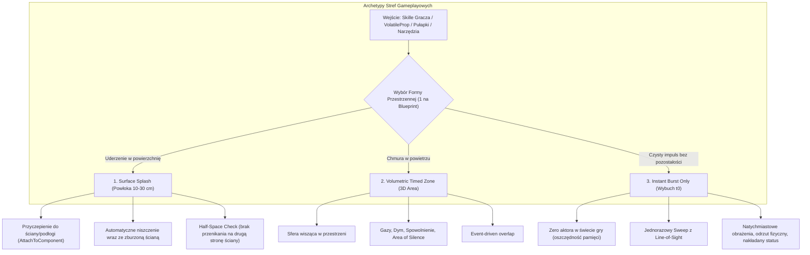
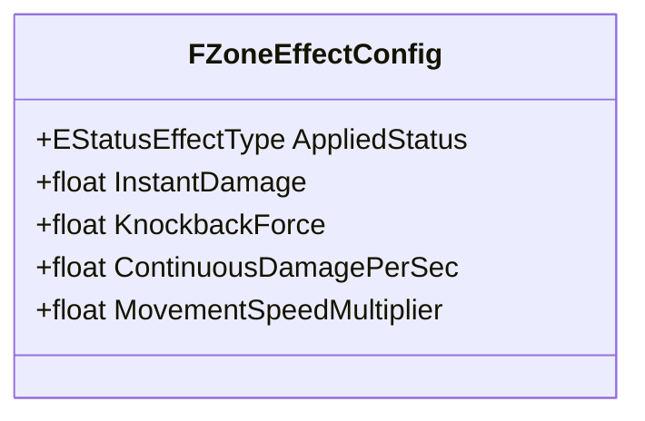

# Specyfikacja Techniczna i Projektowa: System Stref Statusów (Status Zone System)

Dokument stanowi **kompletną kartę projektowo-architektoniczną** dla modułu stref (`Status Zones`) w projekcie *Dungeon Crawler Co-op* (Unreal Engine 5.8 C++, `MYPROJECT_API`).
Definiuje transformację wąskiego aktora `AElementalStatusZone` w **uniwersalny, modułowy system stref gameplayowych i środowiskowych**.

---

## 1. Wizja i Cele Nowego Systemu

Dotychczasowy aktor `AElementalStatusZone` był ściśle powiązany z wąskim pojęciem żywiołów (kałuże wody, plamy oleju, ogień) i posiadał sztywno zakodowane parametry (np. `LiquidSurfaceHeight = 35.0f`, `FireSurfaceHeight = 85.0f`).

Nowy system **Status Zone** realizuje następujące filary:
1. **Uniwersalność Domenowa:**
   Strefa reprezentuje dowolny obszar oddziaływania na gameplay w lochu:
   - **Żywioły i Ciecze:** Ogień, plama oleju, rozlana woda, kwas.
   - **Gazy i Zjawiska Środowiskowe:** Trująca chmura, gęsty dym (blokada LoS/celowania), para wodna.
   - **Efekty Gameplayowe i Spowolnienia:** Strefa spowolnienia ruchu (`MovementSpeedMultiplier`), pajęczyna, strefa uciszenia magii (*Area of Silence*).
2. **Modularność Formy Przestrzennej (3 Czyste Archetypy):**
   - **Surface Splash (Powłoka Powierzchniowa):** Cienka warstwa (10–30 cm) przylegająca do geometrii (`DungeonStructureBase`, podłogi, ściany, sufity, a także ruchome mechanizmy).
   - **Volumetric Timed Zone (Wolumen Przestrzenny w Czasie):** Trójwymiarowa bryła (sfera) zawieszona w powietrzu przez czas $T$.
   - **Instant Radial Burst (Chwilowy Wybuch):** Jednorazowe zdarzenie w klatce $t_0$ sprawdzające Line of Sight, niepozostawiające trwałego aktora strefy.
3. **Zasada Czystego Testowania (1 Forma na Dany Blueprint):**
   - W fazie implementacji i testów `AVolatileProp` wybiera **dokładnie jeden tryb** (`EVolatileZoneSpawnMode`), co pozwala na precyzyjną, izolowaną weryfikację zachowania każdego typu w grze (brak nakładających się zmiennych).
4. **Architektura Co-op i Optymalizacja Sieciowa (1–6 Graczy):**
   - **Zero-Bandwidth Timers:** Replikacja wyłącznie `ServerEndTime`. Klienci lokalnie odliczają czas i wygaszają wizualia.
   - **Server-Authoritative Gameplay:** Aplikacja statusów, obrażeń DoT i spowolnienia następuje wyłącznie na Serwerze.
   - **Net Dormancy:** Strefy po utworzeniu przechodzą w uśpienie replikacji (`DORM_DormantAll`), oszczędzając CPU serwera.
5. **Przyczepianie do Podłoża / Ściany (`AttachToComponent`):**
   - Powłoka *Surface Splash* przyczepia się do trafionego komponentu (np. ściany `DungeonStructureBase`).
   - W przypadku zburzenia/zniszczenia ściany, powłoka jest automatycznie niszczona wraz z rodzicem (brak lewitujących plam w powietrzu).

---

## 2. Trzy Fundamentalne Archetypy Stref

---

## 3. Zunifikowana Karta Efektu (`FZoneEffectConfig`)

Pola w `FZoneEffectConfig`:
- **Instant:**
  - `InstantDamage`: jednorazowe obrażenia w klatce detonacji (dla `InstantBurstOnly`).
  - `KnockbackForce`: radialny odrzut fizyczny obiektów i graczy z LoS.
- **Status:**
  - `AppliedStatus`: typ nakładanego żywiołu (`Burning`, `Wet`, `Oiled`, `Electrified`, `None`). Aplikowany przy wejściu i odświeżany co okres.
- **Continuous:**
  - `ContinuousDamagePerSec`: ciągłe obrażenia co sekundę (np. ogień, kwas w strefie).
  - `MovementSpeedMultiplier`: mnożnik prędkości (np. $0.5$ dla spowolnienia w oleju).

---

## 4. Reakcje Chemiczne i Zbieżność Stref (Zone Interactivity)

| Istniejąca Strefa | Trafienie / Wejście innej strefy | Wynik Reakcji |
| :--- | :--- | :--- |
| **Surface Splash: Olej** | Ogień (Pocisk lub Strefa) | **Podpalenie strefy:** Przekształcenie w płonącą powłokę, obrażenia podpalenia, reakcja łańcuchowa. |
| **Surface Splash: Woda** | Ogień | **Odparowanie:** Powstaje chmura pary wodnej (*Volumetric Steam Zone*), gasząca pożar i zasłaniająca widok. |
| **Surface Splash: Woda** | Elektryczność | **Przewodzenie:** Cała kałuża staje się strefą pod napięciem zadającą obrażenia szokowe. |
| **Volumetric: Trujący Gaz** | Ogień | **Detonacja Gazowa:** Natychmiastowy *Radial Burst* wybuchu, strefa gazu znika w płomieniach. |
| **Surface Splash: Dowolna** | Spłukanie dużą ilością wody | **Oczyszczenie:** Usunięcie kwasu lub oleju z posadzki / ściany (reguła Liquid Displacement). |

---

## 5. Dziennik Problemów i Stan Badań: Archetyp Surface Splash

Podczas testów na mapie deweloperskiej zidentyfikowano następujące kwestie wymagające spokojnej, metodycznej analizy:

### Problem 1: Rozbieżność między wizualnym obrysem (Perimeter LoS) a kolizją gameplayową
- **Symptom:** Na zrzucie ekranu czerwony obrys wielokąta debugowego (`CachedPerimeterPoints`) prawidłowo zatrzymuje się na ścianach i filarach lochu. Natomiast pod spodem `ZoneCollision` jest pełną sferą 3D (`USphereComponent`, $R=600\text{ cm}$), która przenika przez narożniki ścian.
- **Efekt uboczny:** Gracz stojący za narożnikiem ściany znajdował się poza narysowanym obrysem, ale wewnątrz sfery kolizji. Dopóki `HasExplosionLineOfSight` uznawał widoczność za poprawną, gracz otrzymywał status mimo stania poza plamą.
- **Kierunek rozwiązania:** Doprowadzenie do pełnej zgodności między sprawdzaniem obecności w wielokącie a przyznawaniem statusu.

### Problem 2: Wykrywanie obecności gracza w klatce narodzin strefy ($t_0$)
- **Symptom:** Gracz stojący bezpośrednio obok detonującej beczki nie otrzymywał statusu w chwili wybuchu i musiał wyjść ze strefy i wejść do niej ponownie.
- **Przyczyna 1 (Collision Buffer):** W silniku Unreal Engine `GetOverlappingActors()` bezpośrednio po `SpawnActor` w tej samej klatce potrafi zwrócić pustą listę, ponieważ solver fizyki Chaos buduje relacje overlap dopiero po zakończeniu klatki.
- **Przyczyna 2 (Line of Sight Blocker):** Wybuchająca beczka w funkcji `HandleOnDestroyed` wciąż fizycznie istniała w świecie i rzutowała kolizję, blokując promień LoS ze środka plamy do kapsuły gracza.

### Problem 3: Zawodność prób optymalizacji Point-In-Polygon / Raycasting 2D
- **Symptom:** Próba rzutowania wierzchołków na płaszczyznę 2D i badania metodą Even-Odd Rule doprowadziła do całkowitego odrzucenia gracza (brak nakładania statusu w dowolnym punkcie).
- **Przyczyna:** Błędy transformacji układu współrzędnych przy użyciu `FRotationMatrix::MakeFromX(SurfaceNormal)` dla wektora `UpVector` $(0, 0, 1)$ oraz różnice wysokości kapsuły gracza względem punktów na posadzce.
- **Decyzja:** Cofnięcie przekombinowanych zmian i powrót do stabilnego, bezstanowego sprawdzania opartego na sprawdzonej architekturze `ElementalStatusZone`. Dalsze prace nad precyzyjnym dopasowaniem do obrysu zostaną przeprowadzone w dedykowanej sesji testowej.

---

## 6. Roadmapa Rozszerzeń (Future Enhancements & Backlog)

Poniższe koncepcje zostały zaprojektowane architektonicznie i odłożone do wdrożenia po zakończeniu testów bazowych fundamentów:

### A. Kompozycja Wielu Stref (Multi-Zone Spawning na jednym obiekcie)
- Umożliwienie obiektowi (np. specjalistycznej butli kwasowej) jednoczesnego zespawnowania fali uderzeniowej (`Instant Burst`), plamy na posadzce (`Surface Splash`) oraz wiszącej chmury gazu (`Volumetric Zone`).
- Osobne karty konfiguracji: `InstantBurstConfig`, `SurfaceSplashConfig`, `VolumetricConfig`.

### B. Sekwencjonowanie w Czasie (Delayed Cascading Events)
- Opcjonalne opóźnienia czasowe między kolejnymi formami (np. najpierw wybuch $t_0$, po $0.2\text{ s}$ rozbryzg cieczy, po $0.5\text{ s}$ uwolnienie oparów).
- Bezpieczna synchronizacja sieciowa serwer $\rightarrow$ klient przez zdarzeniowe RPC lub pojedyncze tagi sekwencji.

### C. Zaawansowane Dźwięki i Efekty Magiczne (*Area of Silence*)
- Wyciszanie szyn audio gracza wchodzącego w strefę uciszenia (UE Submix Effect / Audio Modulation).
- Blokowanie rzucania czarów (flaga `bBlockMagicCasting` weryfikowana przez komponent umiejętności gracza).
