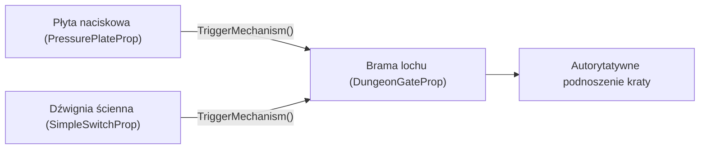
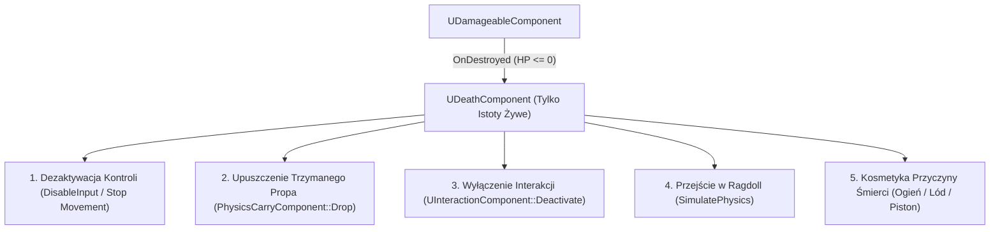

# Specyfikacja i Plan Rozwoju: Środowiskowa Pętla Rozgrywki (Environmental & Dungeon Interaction Loop)

**Wersja:** 1.0  
**Status:** Zaakceptowany do realizacji  
**Data:** 2026-09-29  
**Cel:** Połączenie istniejących systemów (mechanizmy, fizyka Chaos, siatka żywiołów, interfejsy) w grywalną pętlę lochu (Vertical Slice).

---

## 1. Filozofia i Założenia Architektoniczne

Zamiast budować abstrakcyjne, wielkie systemy (jak złożony Combat czy siatkowy Ekwipunek), projekt koncentruje się na **unikalnym fundamencie fizycznego Immersive Sima**:
* Wykorzystujemy gotowe, ale nieużywane dotąd elementy: [`PressurePlateProp`](file:///e:/UE_PROJECTS/MyProject/Source/MyProject/Dungeon/Mechanisms/Switches/PressurePlateProp.h), [`SimpleSwitchProp`](file:///e:/UE_PROJECTS/MyProject/Source/MyProject/Dungeon/Mechanisms/Switches/SimpleSwitchProp.h), [`PistonTrap`](file:///e:/UE_PROJECTS/MyProject/Source/MyProject/Dungeon/Mechanisms/Traps/PistonTrap.h) oraz [`IMechanismReceiverInterface`](file:///e:/UE_PROJECTS/MyProject/Source/MyProject/Shared/Interfaces/MechanismReceiverInterface.h).
* Zamykamy **pełną pętlę interakcji lochu**: *Zagadka środowiskowa -> Aktywacja mechanizmu -> Otwarcie przejścia -> Ominięcie pułapki -> Zdobycie fizycznej nagrody*.

---

## 2. Krok 1: Otwarty System Modyfikatorów Ruchu i Efektów Podłoża

### 2.1. Problem Projektowy
Hardcodowanie pojedynczego sprawdzenia `if (bIsOnOil) GroundFriction = 0.8f` w kodzie postaci jest antywzorcem. Projekt potrzebuje mechanizmu otwartego na:
* Śliskie podłoża (`Oiled`, `Ice`),
* Spowalniające ciecze / przeszkody (`Mud`, `Water`, `Webs`),
* Statusy wewnętrzne postaci (np. `Chilled`, przyszłe zatrucie, alkohol powodujący pływanie kamery / zaburzenia wektora wejścia).

### 2.2. Proponowana Architektura C++

Wprowadzamy strukturę wagowych modyfikatorów ruchu i percepcji:

```cpp
USTRUCT(BlueprintType)
struct FMovementModifier
{
    GENERATED_BODY()

    UPROPERTY(EditAnywhere, BlueprintReadWrite)
    float SpeedMultiplier = 1.0f; // Mnożnik MaxWalkSpeed (np. 0.7f dla Chilled)

    UPROPERTY(EditAnywhere, BlueprintReadWrite)
    float GroundFrictionMultiplier = 1.0f; // Mnożnik GroundFriction (np. 0.1f dla Oil/Ice)

    UPROPERTY(EditAnywhere, BlueprintReadWrite)
    float BrakingDecelerationMultiplier = 1.0f; // Mnożnik drogi hamowania (np. 0.05f dla poślizgu)

    UPROPERTY(EditAnywhere, BlueprintReadWrite)
    float CameraWobbleIntensity = 0.0f; // Przyszłościowy efekt sensoryczny (np. alkohol/zawroty głowy)
};
```

### 2.3. Integracja z Istniejącymi Komponentami
1. **Wykrywanie podłoża:**
   * W cyklu ticku lub przy zmianie komórki posadzki postać pyta [`UDungeonSurfaceSubsystem`](file:///e:/UE_PROJECTS/MyProject/Source/MyProject/Environment/Zones/Subsystems/DungeonSurfaceSubsystem.h) o tożsamość i status komórki pod stopami (`GetCellAtWorldLocation`).
   * Jeśli komórka posiada status `Oiled` $\rightarrow$ zgłaszany jest modyfikator poślizgu.
2. **Kalkulacja wypadkowa w `PlayerCharacter`:**
   * Postać agreguje modyfikatory ze statusów na ciele ([`UStatusEffectComponent`](file:///e:/UE_PROJECTS/MyProject/Source/MyProject/Shared/Components/StatusEffectComponent/StatusEffectComponent.h)) oraz z podłoża.
   * `UCharacterMovementComponent` aplikuje obliczone wartości:
     $$\text{FinalFriction} = \text{DefaultFriction} \times \text{FrictionMultiplier}$$
     $$\text{FinalSpeed} = \text{DefaultSpeed} \times \text{SpeedMultiplier}$$
3. **Fizyka propów na podłożu:**
   * Skrzynie i głazy poruszające się po zaolejonych komórkach otrzymują zmniejszone tłumienie liniowe (`LinearDamping`), dzięki czemu pchnięty głaz sunie dalej.

---

## 3. Krok 2: Odbiorniki Mechanizmów – Brama i Drzwi Lochu (`DungeonGateProp` / `DoorProp`)

### 3.1. Rola i Odpowiedzialność
* Aktor `ADungeonGateProp` reprezentuje kratę (Portcullis) lub kamienne wrota odcinające przejście.
* Implementuje [`IMechanismReceiverInterface`](file:///e:/UE_PROJECTS/MyProject/Source/MyProject/Shared/Interfaces/MechanismReceiverInterface.h).



### 3.2. Wymagania Techniczne
1. **Server-Authoritative:**
   * Położenie kraty jest wyliczane autorytatywnie na serwerze (interpolacja $Z$ lub serwerowy Timeline z replikowanym stanem `EGateState: Closed, Opening, Open, Closing`).
   * Zmiana stanu wysyła do klientów jedno zdarzenie `OnRep_GateState` (Zero-Bandwidth w spoczynku).
2. **Kolizja ze sweepem i Anti-Crush:**
   * Brama opadająca w dół wykonuje test kolizji (`bSweep = true`).
   * Jeśli uderzy w gracza lub skrzynię:
     * Opcja A: Zadaje obrażenia miażdżące ([`UDamageableComponent`](file:///e:/UE_PROJECTS/MyProject/Source/MyProject/Shared/Components/DamageableComponent/DamageableComponent.h)).
     * Opcja B: Cofa się lub zatrzymuje na przeszkodzie, dopóki obiekt nie zostanie usunięty.
3. **Współpraca z płytą naciskową:**
   * Gdy na płycie stoi gracz lub ciężki głaz ($\ge 50\text{ kg}$) $\rightarrow$ brama podnosi się.
   * Gdy ciężar zostanie zdjęty $\rightarrow$ brama natychmiast opada z głośnym uderzeniem o posadzkę.

---

## 4. Krok 3: Interaktywna Skrzynia ze Skarbami (`DungeonChestProp`)

### 4.1. Podwójna Ścieżka Interakcji (Dual-Interaction Path)
Skrzynia wspiera dwie metody dostępu, idealnie wpisujące się w zasady Immersive Sima:
1. **Ścieżka Pacyfistyczna / Narzędziowa:**
   * Gracz podchodzi i wciska `E` ([`InteractableInterface`](file:///e:/UE_PROJECTS/MyProject/Source/MyProject/Shared/Interfaces/InteractableInterface.h)).
   * Wieko unosi się płynnie, gracz może zajrzeć do środka i podnieść skarby dłońmi ([`PhysicsCarryComponent`](file:///e:/UE_PROJECTS/MyProject/Source/MyProject/Shared/Components/PhysicsCarryComponent/PhysicsCarryComponent.h)).
2. **Ścieżka Siłowa (Brute-Force Destruction):**
   * Skrzynia posiada [`UDamageableComponent`](file:///e:/UE_PROJECTS/MyProject/Source/MyProject/Shared/Components/DamageableComponent/DamageableComponent.h) oraz tożsamość `Wood` ([`IMaterialProviderInterface`](file:///e:/UE_PROJECTS/MyProject/Source/MyProject/Shared/Interfaces/MaterialProviderInterface.h)).
   * Można ją rozbić rzuconym głazem, wybuchem beczki lub spalić ogniem (`Burning`).
   * Przy zniszczeniu skrzynia rozpada się, a zawartość wypada na podłogę.

### 4.2. Spawnowanie Fizycznego Lootu
* Tabela lootu definiowana jako tablica klas:
  ```cpp
  UPROPERTY(EditAnywhere, Category = "Loot")
  TArray<TSubclassOf<AActor>> PossibleLootActors;
  ```
* Przy otwarciu lub zniszczeniu serwer spawnuje fizyczne instancje przedmiotów lochu:
  * Butelki z oliwą lub wodą ([`AVolatileProp`](file:///e:/UE_PROJECTS/MyProject/Source/MyProject/Dungeon/Props/VolatileProp.h)),
  * Kamienne pociski,
  * Monety / klejnoty ze statusem fizycznym,
  * Prowizoryczne tarcze/deski.
* Przedmioty otrzymują niewielki losowy impuls radialny w górę i na boki (`AddImpulse`), efektownie rozsypując się po posadzce lochu.

---

## 5. Krok 4: System Śmierci Istot Żywych i Ragdoll (`UDeathComponent`)

### 5.1. Uzasadnienie Architektoniczne (Podział Prop vs Istota Żywa)
* **Problem:** [`UDamageableComponent`](file:///e:/UE_PROJECTS/MyProject/Source/MyProject/Shared/Components/DamageableComponent/DamageableComponent.h) odpowiada za czystą integralność (punkty wytrzymałości, odporności, obrażenia kinetyczne) i znajduje się zarówno na propach (ściany, skrzynie, beczki), jak i na postaciach.
* **Rozwiązanie (SRP & Composition):** 
  * Propy przy `CurrentDurability <= 0` ulegają zniszczeniu (`Destroy()` / gruz / Chaos Fracture).
  * Postacie graczy i wrogów (istoty żywe) nie mogą po prostu "zniknąć ze świata". Otrzymują dedykowany komponent: **`UDeathComponent`** (w `Shared/Components/DeathComponent/`).
  * `UDeathComponent` nasłuchuje zdarzenia `UDamageableComponent::OnDestroyed` i przejmuje pełną kontrolę nad przejściem postaci w **Stan Śmierci (Death State)**.



### 5.2. Etapy Sekwencji Zgonu
1. **Dezaktywacja kontroli i interakcji:**
   * Wyłączenie wejścia gracza (`APlayerController::DisableInput`),
   * Zatrzymanie ruchu (`UCharacterMovementComponent::DisableMovement()`),
   * Dezaktywacja [`UInteractionComponent`](file:///e:/UE_PROJECTS/MyProject/Source/MyProject/Shared/Components/InteractionComponent/InteractionComponent.h) — martwa postać nie może już naciskać przycisków ani podnosić przedmiotów.
2. **Upuszczenie niesionych obiektów:**
   * Jeśli postać niosła beczkę lub tarczę ([`UPhysicsCarryComponent`](file:///e:/UE_PROJECTS/MyProject/Source/MyProject/Shared/Components/PhysicsCarryComponent/PhysicsCarryComponent.h)), obiekt jest natychmiast upuszczany ze zwolnieniem blokady fizycznej.
3. **Fizyczny Ragdoll (Cylinder dzisiaj -> Skeletal Mesh w przyszłości):**
   * Wyłączenie kolizji kapsuły (`UCapsuleComponent` -> `SetCollisionEnabled(NoCollision)` lub zmiana kanału kolizji).
   * Włączenie fizyki na mesh (`SetSimulatePhysics(true)`, profil `Ragdoll`).
   * **Dla obecnego cylindra zastępczego:** Cylinder bezwładnie upada na ziemię pod wpływem wektora uderzenia i grawitacji.
   * **Dla docelowego Skeletal Mesha:** Płynne wejście w szkieletowy ragdoll (`SetAllBodiesSimulatePhysics(true)`).
4. **Efekty kosmetyczne przyczyny zgonu (Cause of Death FX):**
   * `UDeathComponent` sprawdza dominujący status z [`UStatusEffectComponent`](file:///e:/UE_PROJECTS/MyProject/Source/MyProject/Shared/Components/StatusEffectComponent/StatusEffectComponent.h):
     * **Śmierć od Ognia (`Burning`):** Podmiana materiału na zwęglony/czarny, dymiące cząsteczki spalenizny.
     * **Śmierć od Lodu / Zamrożenia (`Frozen`):** Zablokowanie ragdolla w sztywną lodową rzeźbę / statuę.
     * **Śmierć od Zmiażdżenia (Piston / Krata lochu):** Natychmiastowy potężny impuls kinetyczny w stronę podłogi.

---

## 6. Krok 5 (Opcjonalny): Lód i Żywioł Mrozu (Ice / Chilled / Frozen)

### 6.1. Analiza Rynku i Balans Gry (Zabezpieczenie przed "Permafreeze")
> [!CAUTION]
> **Zasada Przeciwdziałania Frustracji (No Cheap Hard CC):**  
> Kombinacja `Wet` + `Ice` = Natychmiastowe zamrożenie gracza w bryłę lodu na 5 sekund jest mechaniką, która w grach akcji / co-op kompletnie niszczy płynność i wywołuje frustrację.

### 6.2. Rozwiązanie Dwupoziomowe:

#### A. Mózg i Podłoże (Komórki Powierzchniowe):
* Komórka `Wet` potraktowana efektem zimna zamarza i staje się **`Ice` (Lód)**.
* Lód na podłożu ma skrajnie niskie tarcie (`GroundFriction = 0.02f`) i brak możliwości gwałtownego skręcania. Postacie i propy wpadają w niekontrolowany ślizg.
* Ogień (`Burning`) lub źródło ciepła topi lód z powrotem w `Wet`.

#### B. Postacie i Przeciwnicy (Status Aktorów):
* Efekt zimna nakłada w pierwszej kolejności status **`Chilled` (Wychłodzenie)**:
  * Spowolnienie prędkości chodu o np. 30%.
  * Wolniejsze podnoszenie przedmiotów i obrót.
* Status **`Frozen` (Twarde Zamrożenie / Bryła lodu)**:
  * **NIE** zachodzi automatycznie po pojedynczym trafieniu w mokry cel.
  * Wymaga kumulacji (np. paska wychłodzenia `ColdBuildup >= 100%`) lub jest zarezerwowany dla słabych obiektów środowiskowych (zamrożenie drewnianej skrzynki, zamrożenie wody w misie).
  * Gracz posiada odruch wyzwalania się (stamina / mashowanie klawiszy) lub odporność na ponowne zamrożenie (Diminishing Returns).

---

## 7. Krok 6: Scenariusz Poligonu Doświadczalnego (Theme Park Vertical Slice)

Po wdrożeniu powyższych modułów w mapie [`Map_Dungeon_01.umap`](file:///e:/UE_PROJECTS/MyProject/Content/Maps/Map_Dungeon_01.umap) konfigurujemy pierwszy kompletny pokój zagadki:

```text
[ Pokój 1: Korytarz Wejściowy ]
         │
         ▼
[ Płyta Naciskowa (Wymóg: 50 kg) ]  ───(Otwiera)───►  [ Ciężka Krata Lochu ]
         │                                                      │
    (Brak głazu w pobliżu)                                      ▼
         │                                            [ Korytarz z Pułapką ]
         ▼                                                      │
[ Boczna Sala Magazynowa ]                                      ▼
- Zaolejona podłoga (ślizg skrzyń)                     [ PistonTrap / Płomienie ]
- Ciężka skrzynia 60 kg                                         │
- Gracz przepycha skrzynię na płytę                             ▼
                                                       [ Skarbiec z ChestProp ]
                                                       - Otwarcie kluczem lub
                                                       - Rozbicie wieka głazem
```

---

## 8. Kolejność Realizacji Zadań (Sprint Roadmap)

1. **Sprint 1 (Ruch i Tarcie):**
   * Struktura `FMovementModifier` w `PlayerCharacter`.
   * Integracja odczytu komórki `Oiled` z siatki `UDungeonSurfaceSubsystem` i aplikacja do `UCharacterMovementComponent`.
   * Przetestowanie ślizgania się gracza i skrzyń po zaolejonym podłożu.
2. **Sprint 2 (Mechanizmy Przejścia):**
   * Stworzenie klasy `ADungeonGateProp` z obsługą `IMechanismReceiverInterface`.
   * Połączenie w edytorze z `PressurePlateProp` (brama reagująca na nacisk).
   * Sprawdzenie detekcji kolizji opadającej kraty (Anti-Crush).
3. **Sprint 3 (Nagroda i Interakcja):**
   * Stworzenie klasy `ADungeonChestProp` z obsługą `InteractableInterface` oraz `UDamageableComponent`.
   * Implementacja fizycznego wyrzutu lootu.
4. **Sprint 4 (Śmierć i Ragdoll Istot Żywych):**
   * Stworzenie komponentu `UDeathComponent` w `Shared/Components/DeathComponent/`.
   * Podpięcie pod `UDamageableComponent::OnDestroyed` w `PlayerCharacter`.
   * Odłączenie inputu, wyłączenie CMC, upuszczenie trzymanego propa, fizyczny upadek/ragdoll cylindra i efekty śmierci (spalenie/zmiażdżenie).
5. **Sprint 5 (Zagadka w Theme Parku):**
   * Zestawienie w `Map_Dungeon_01` kompletnej zagadki z pokoju magazynowego do skarbca.
6. **Sprint 6 (Opcjonalny - Lód i Chilled):**
   * Rozszerzenie `UElementalReactionRules` i `UDungeonSurfaceSubsystem` o stan `Ice` na posadzce oraz `Chilled` na postaciach z modyfikatorem prędkości.
