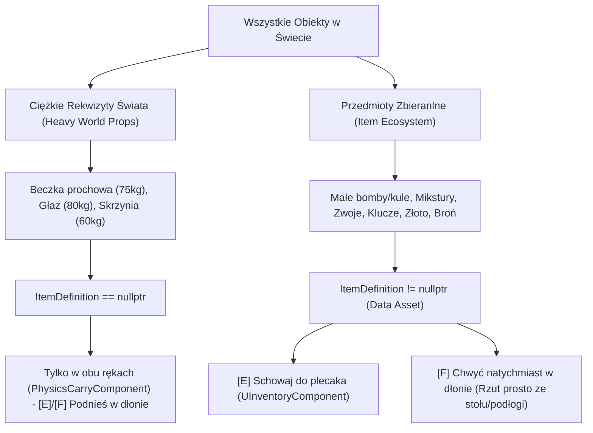
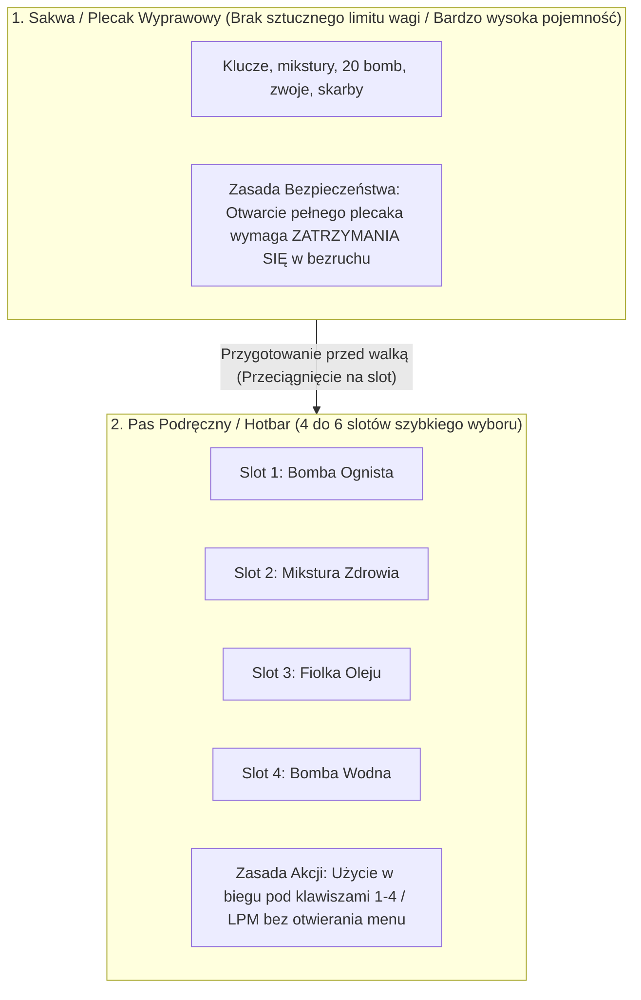
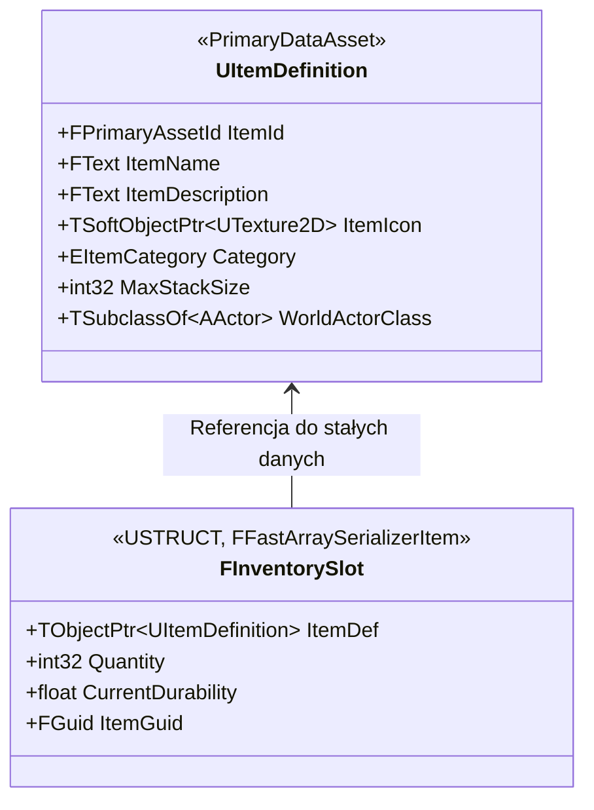
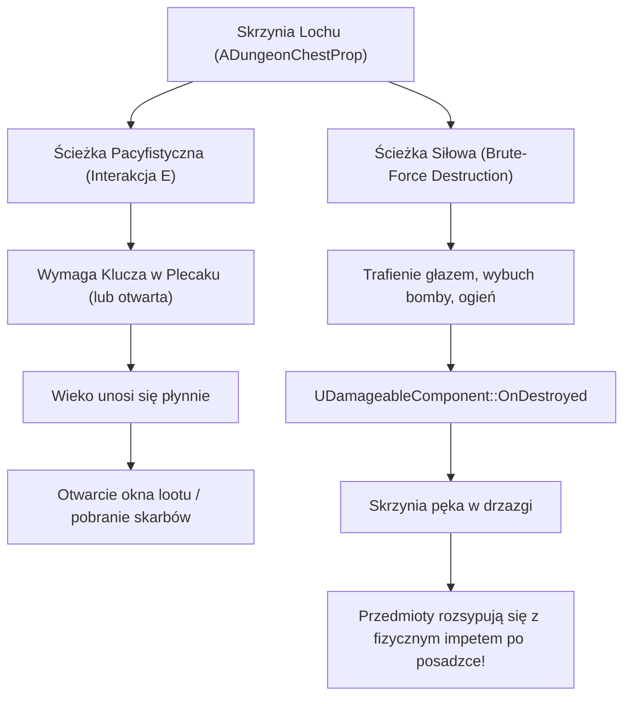

# Specyfikacja Architektoniczna: System Przedmiotów, Kontenerów i Ekwipunku (Item & Inventory System)

**Wersja:** 1.1  
**Status:** Zaakceptowana do realizacji / Gotowa do Fazy 1  
**Data aktualizacji:** 2026-10-09  
**Cel:** Zdefiniowanie tożsamości "Przedmiotu" w grze, separacja ciężkich obiektów fizycznych od przedmiotów plecaka, specyfikacja wygodnego ekwipunku bez sztucznych ograniczeń (Frictionless / Hoarder-Friendly UX), pętla szybkiego wyboru (Hotbar), interakcja prosto ze świata (BG3 style) oraz optymalizacja sieciowa i UI.

---

## 1. Filozofia i Główne Założenia (Core Fantasy & Frictionless UX)

W odróżnieniu od gier zmuszających gracza do "inventory tetrisa" lub powolnego człapania z powodu przeciążenia, nasz projekt łączy **fizyczny fundament Immersive Sima** z **wygodą zmodowanego Skyrima / Elden Ring**:

### 1.1. Żelazna Reguła Podziału:
1. **Ciężkie Rekwizyty Świata ([`AInteractivePropBase`](file:///e:/UE_PROJECTS/MyProject/Source/MyProject/Dungeon/Props/InteractivePropBase.h) / [`AVolatileProp`](file:///e:/UE_PROJECTS/MyProject/Source/MyProject/Dungeon/Props/VolatileProp.h)):**
   * Posiadają `ItemDefinition == nullptr`.
   * Gracz manipuluje nimi wyłącznie za pomocą rąk ([`UPhysicsCarryComponent`](file:///e:/UE_PROJECTS/MyProject/Source/MyProject/Shared/Components/PhysicsCarryComponent/PhysicsCarryComponent.h)).
   * Służą do zatykania korytarzy, dociskania płyt naciskowych, osłony przed pociskami i tworzenia wyłomów w ścianach.
2. **Przedmioty Ekwipunku (Items with `UItemDefinition`):**
   * Posiadają przypisany Data Asset (`ItemDefinition != nullptr`).
   * Mogą trafić do plecaka (`[E]`) LUB zostać od razu chwycone w dłonie do rzutu (`[F]`).

---

## 2. Podwójna Warstwa UX: Plecak Wyprawowy vs Pas Podręczny

Aby połączyć brak frustrujących limitów z taktycznym napięciem w walce, wprowadzamy **dwuwarstwowy model dostępu**:

### 2.1. Zasady Warstw:
* **Plecak Wyprawowy (Wielka Pojemność, Czyste Kategorie):**
  * Gracz zbiera wszystko, na co ma ochotę – zero frustracji, zero wyrzucania skarbów na ziemię.
  * Kategorie (Tabs): *Alchemia & Mikstury*, *Przedmioty Miotane*, *Klucze & Zadania*, *Kosztowności*, *Ekwipunek*.
  * **Koszt taktyczny (Zatrzymanie w bezruchu):** Aby otworzyć pełne okno plecaka, postać musi się zatrzymać (`CharacterMovementComponent` blokuje ruch na czas otwartego menu). Nie da się przekładać ekwipunku podczas sprintu przed toczącym się głazem lub w ferworze walki.
* **Pas Podręczny (Hotbar 1–4):**
  * 4–6 slotów pod klawiszami `1`, `2`, `3`, `4`.
  * Gracz w biegu wybiera slot i natychmiast wyciąga przedmiot do ręki / pije miksturę.

---

## 3. Interakcja ze Światem: Szybki Loot vs Natychmiastowy Rzut (BG3 Style)

Gdy celownik gracza ([`UInteractionComponent`](file:///e:/UE_PROJECTS/MyProject/Source/MyProject/Shared/Components/InteractionComponent/InteractionComponent.h)) najedzie na obiekt fizyczny:

| Typ Obiektu w Celowniku | Przypisany `ItemDefinition` | Klawisz **`[E]`** | Klawisz **`[F]`** |
| :--- | :---: | :--- | :--- |
| **Ciężki Rekwizyt** (Beczka 75kg, Głaz 80kg) | `nullptr` | **Podnieś w dłonie** (`PhysicsCarry`) | **Podnieś w dłonie** (`PhysicsCarry`) |
| **Przedmiot Ekwipunku** (Mała bomba, fiolka) | `DA_...` (Wskazuje na asset) | **Zbierz do plecaka** (Szybki loot do torby) | **Chwyć w dłonie** (Natychmiastowy rzut prosto z podłogi) |

### Korzyści dla Rozgrywki:
* **Ekspresowy Looting:** Gracz biegnie przez pokój i spamuje `E`, zgarniając wszystkie skarby do torby.
* **Emergent Gameplay (Taktyka sytuacyjna):** W trakcie walki gracz widzi na stole bombę ogniową. Nie musi jej zbierać i wchodzić do menu — wciska `F`, bomba trafia w dłoń, a kliknięcie `LPM` natychmiast ciska nią w przeciwnika.

---

## 4. Tożsamość Przedmiotu: Wzorzec Pyłka (Flyweight Pattern)

Rozdzielamy niezmienne dane statyczne (`UItemDefinition`) od instancji w slocie (`FInventorySlot`):

### 4.1. Statyczna Definicja (`UItemDefinition` / `UPrimaryDataAsset`)
Pojedynczy plik współdzielony przez wszystkich graczy:
* **Tożsamość:** `FText ItemName`, `FText ItemDescription`, `TSoftObjectPtr<UTexture2D> ItemIcon`.
* **Kategoria (`EItemCategory`):**
  * `Consumable` — mikstury leczenia, odtrutki, eliksiry.
  * `Throwable` — małe bomby szklane, noże, butle z oliwą.
  * `KeyItem` — klucze do bram, symbole, pieczęcie.
  * `Valuable` — monety, rubiny, puchary.
  * `Equipment` — broń, tarcze, pochodnie.
* **Stackowanie:** `MaxStackSize` (np. 99 dla mikstur/bomb, 1 dla kluczy i broni).
* **Most powrotny do świata:** `TSubclassOf<AActor> WorldActorClass` (np. `BP_GlassOrb_Fire` sponowany przy wyrzuceniu przedmiotu na ziemię).

### 4.2. Instancja w Ekwipunku (`FInventorySlot`)
Lekka struktura przesyłana przez sieć w tablicy slotów:
* `TObjectPtr<UItemDefinition> ItemDef`
* `int32 Quantity`
* `float CurrentDurability`
* `FGuid ItemGuid`

---

## 5. Architektura Techniczna i Wydajność (Zero Lag & Zero Bandwidth)

Aby obsłużyć setki przedmiotów w ekwipunku bez spadków płynności i obciążania sieci:

### 5.1. Pamięć RAM (Znikomy narzut)
* Pojedynczy slot `FInventorySlot` zajmuje zaledwie **~24 bajty**.
* 500 różnych przedmiotów w plecaku to zaledwie **~12 KB** pamięci. Zapis stanu gry (SaveGame) wykonuje się w ułamku milisekundy.

### 5.2. Replikacja Sieciowa: `FFastArraySerializer` + `COND_OwnerOnly`
* W kooperacji (1–6 graczy) inni gracze nie pobierają zawartości Twojego plecaka (`COND_OwnerOnly`).
* `FFastArraySerializer` wysyła przez sieć **wyłącznie deltę** (np. 4-bajtową informację o zmianie liczby mikstur w slocie). Zużycie pasma wynosi **0 bajtów/s w spoczynku**.
* Wszelkie operacje dodawania/usuwania są autorytatywne na serwerze (`REQUIRE_AUTHORITY()`).

### 5.3. Renderowanie UI: Wirtualizacja Widżetów (`UTileView` / `UListView`)
* **Zakaz tworzenia setek widżetów w pętli w `ScrollBox`.**
* Stosujemy natywne widżety Unreal Engine: **`UTileView`** z włączoną wirtualizacją:
  * Silnik tworzy na ekranie tylko tyle kafelków, ile fizycznie widać w oknie (np. 16 kafelków).
  * Podczas przewijania widżety są błyskawicznie recyklingowane i zasilane danymi kolejnych slotów.
  * **Rezultat:** UI otwiera się natychmiast (0.001 ms) i działa w stałych 60–120 FPS nawet przy 10 000 przedmiotów.

---

## 6. Kontenery Lootu: Skrzynie Lochu (`ADungeonChestProp`)

Skrzynia na skarby wspiera **dwie ścieżki dostępu**:

* **Tożsamość materiałowa:** `Wood` ([`IMaterialProviderInterface`](file:///e:/UE_PROJECTS/MyProject/Source/MyProject/Shared/Interfaces/MaterialProviderInterface.h)).
* **Trwałość:** [`UDamageableComponent`](file:///e:/UE_PROJECTS/MyProject/Source/MyProject/Shared/Components/DamageableComponent/DamageableComponent.h) z wartością `Durability = 40.0f`.
* **Rozrzut Fizyczny:** Przy zniszczeniu wyrzucane przedmioty otrzymują losowy wektor radialny w górę i na boki (`AddImpulse`).

---

## 7. Plan Wdrożenia (Roadmap Krok po Kroku)

### Faza 1: Fundament Danych i Definicje Przedmiotów (C++ Core)
1. Utworzenie enuma `EItemCategory` w `Source/MyProject/Dungeon/Items/Data/ItemTypes.h`.
2. Klasa `UItemDefinition` (`UPrimaryDataAsset`) z polami tożsamości, kategorii, stackowania i `WorldActorClass`.
3. Dodanie opcjonalnego wskaźnika `TObjectPtr<UItemDefinition> ItemDefinition` do [`AInteractivePropBase`](file:///e:/UE_PROJECTS/MyProject/Source/MyProject/Dungeon/Props/InteractivePropBase.h).

### Faza 2: Struktury Ekwipunku i Komponent (`UInventoryComponent`)
1. Struktura `FInventorySlot` (`FFastArraySerializerItem`) oraz kontener `FInventoryFastArray`.
2. Klasa [`UInventoryComponent`](file:///e:/UE_PROJECTS/MyProject/Source/MyProject/Player/) dodana do [`APlayerCharacter`](file:///e:/UE_PROJECTS/MyProject/Source/MyProject/Player/PlayerCharacter.h):
   * Replikacja Server-Authoritative (`REQUIRE_AUTHORITY()`).
   * Metody `TryAddItem(ItemDef, Quantity)`, `RemoveItemByGuid(...)`, `DropItem(...)`.

### Faza 3: Integracja Interakcji i Sterowania (`[E]` vs `[F]`)
1. Aktualizacja [`UInteractionComponent`](file:///e:/UE_PROJECTS/MyProject/Source/MyProject/Shared/Components/InteractionComponent/InteractionComponent.h) i Enhanced Input w `PlayerCharacter`:
   * Klawisz **`[E]`** $\rightarrow$ Schowanie do plecaka (`UInventoryComponent::TryAddItem`), zniszczenie aktora w świecie.
   * Klawisz **`[F]`** $\rightarrow$ Bezpośrednie podniesienie w ręce przez [`UPhysicsCarryComponent`](file:///e:/UE_PROJECTS/MyProject/Source/MyProject/Shared/Components/PhysicsCarryComponent/PhysicsCarryComponent.h) (gotowość do natychmiastowego rzutu).
2. Obsługa ciężkich rekwizytów (`ItemDefinition == nullptr`) $\rightarrow$ oba klawisze uruchamiają chwyt w dłonie.

### Faza 4: Pas Szybkiego Wyboru (Hotbar) i Blokada Ruchu w Menu
1. Struktura slotów podręcznych (Hotbar 1–4) w `UInventoryComponent`.
2. Logika zatrzymania ruchu w CMC (`DisableMovement` / `StopMovementImmediately`) podczas przeglądania pełnego okna plecaka.

### Faza 5: Interaktywna Skrzynia ze Skarbami (`ADungeonChestProp`)
1. Implementacja `ADungeonChestProp` z podwójną ścieżką (klucz vs rozbicie).
2. Spawnowanie fizycznych aktorów ze skarbami z losowym wektorem rozrzutu.

### Faza 6: Interfejs Użytkownika (UI z Wirtualizacją)
1. Widżet paska podręcznego (Hotbar na dole ekranu z aktywnym podświetleniem).
2. Widżet pełnego plecaka z zakładkami kategorii i natywnym `UTileView` (Skyrim-style, ultra-wydajny, wirtualizowany).
