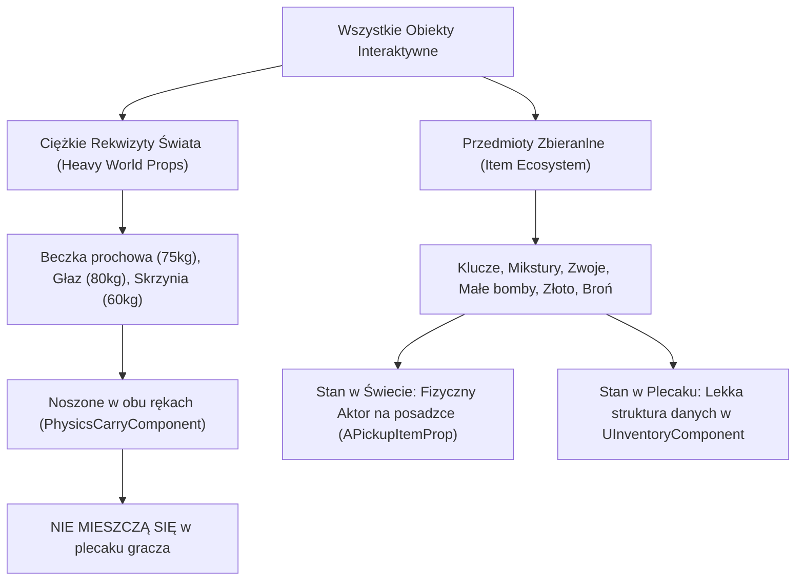
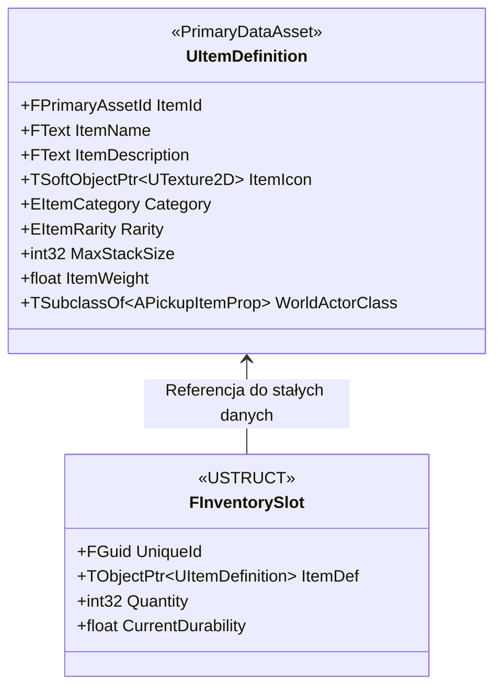
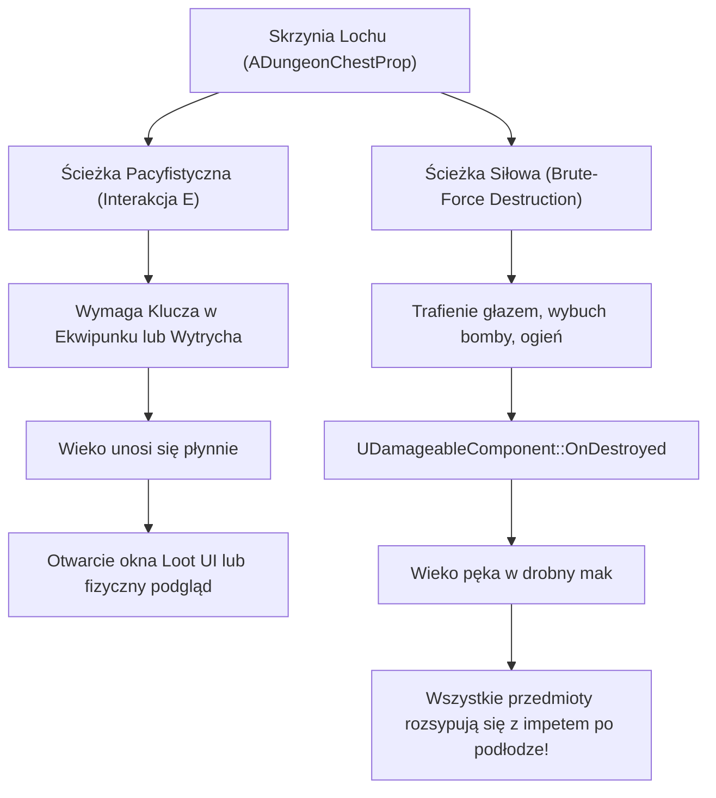

# Specyfikacja Architektoniczna: System Przedmiotów, Kontenerów i Ekwipunku (Item & Inventory System)

**Wersja:** 1.0  
**Status:** Projekt Koncepcyjny / W trakcie analizy  
**Data utworzenia:** 2026-10-08  
**Cel:** Zdefiniowanie tożsamości "Przedmiotu" w grze, separacja obiektów świata fizycznego od przedmiotów ekwipunku, specyfikacja kontenerów lootu (skrzynie) oraz architektura serwerowo-autorytatywnego ekwipunku.

---

## 1. Filozofia i Główne Założenia (Core Fantasy & Immersive Sim)

W odróżnieniu od klasycznych gier RPG, w których każdy obiekt (nawet 50-kilogramowy głaz czy beczka) magicznie trafia do kieszeni gracza w formie ikonki 2D, nasz projekt opiera się na **fizycznym fundamencie Immersive Sima**:



### Żelazna Reguła Podziału:
1. **Ciężkie Rekwizyty Świata ([`AInteractivePropBase`](file:///e:/UE_PROJECTS/MyProject/Source/MyProject/Dungeon/Props/InteractivePropBase.h) / [`AVolatileProp`](file:///e:/UE_PROJECTS/MyProject/Source/MyProject/Dungeon/Props/VolatileProp.h)):**
   * Posiadają dużą masę ($> 15\text{ kg}$) i gabaryty.
   * Gracz manipuluje nimi za pomocą dłoni ([`UPhysicsCarryComponent`](file:///e:/UE_PROJECTS/MyProject/Source/MyProject/Shared/Components/PhysicsCarryComponent/PhysicsCarryComponent.h)).
   * Służą do zatykania korytarzy, dociskania płyt naciskowych, rzucania we wrogów i tworzenia wyłomów w ścianach.
2. **Przedmioty Zbieranlne (Inventory Items):**
   * Obiekty, które postać może schować do sakwy, pasa lub plecaka.
   * W świecie fizycznym reprezentowane przez małą bryłę ze zderzeniami Chaosu.
   * Po zebraniu klawiszem `E` ich fizyczny aktor w świecie zostaje zniszczony/ukryty, a dane trafiają do komponentu ekwipunku gracza.

---

## 2. Tożsamość Przedmiotu: Wzorzec Pyłka (Flyweight Pattern)

Aby zachować wzorcową wydajność pamięciową i sieciową, rozdzielamy **definicję przedmiotu** (niezmienne dane statyczne) od **instancji przedmiotu** (stan faktyczny w plecaku):



### 2.1. Statyczna Definicja (`UItemDefinition` / `UPrimaryDataAsset`)
Pojedynczy Data Asset współdzielony przez wszystkich graczy i instancje:
* **Tożsamość:** Unikalny ID (`FPrimaryAssetId`), Nazwa, Opis, Ikona UI (`TSoftObjectPtr<UTexture2D>`).
* **Kategoria (`EItemCategory`):**
  * `Consumable` — mikstury leczenia, antidota, eliksiry siły.
  * `Throwable` — małe flasze z ogniem, noże do rzucania, bomby ręczne.
  * `KeyItem` — klucze do bram, symbole otwierające mechanizmy, pieczęcie.
  * `Valuable` — monety, rubiny, złote puchary (wymienne na nagrody).
  * `Equipment` — broń biała, tarcze, hełmy, amulety.
* **Właściwości fizyczne:**
  * `MaxStackSize` — limit w jednym slocie (np. klucze `1`, mikstury `5`, złoto `999`).
  * `ItemWeight` — waga pojedynczej sztuki (do ewentualnego limitu udźwigu).
  * `WorldActorClass` — klasa fizycznego aktora spawanego na posadzce przy wyrzuceniu przedmiotu.

### 2.2. Instancja w Ekwipunku (`FInventorySlot`)
Lekka struktura przesyłana przez sieć w tablicy slotów:
* Wskaźnik na definicję: `TObjectPtr<UItemDefinition> ItemDef`.
* Ilość sztuk: `int32 Quantity`.
* Trwałość (opcjonalna): `float CurrentDurability` (dla broni/tarcz).
* Unikalny identyfikator: `FGuid ItemGuid`.

---

## 3. Most Pomiędzy Światem Fizycznym a Ekwipunkiem (World-to-Inventory Pipeline)

Przejście przedmiotu między podłogą lochu a plecakiem gracza musi być w 100% płynne:

### 3.1. Podnoszenie Przedmiotu (Pickup)
1. Gracz nakierowuje celownik na fizyczny przedmiot [`APickupItemProp`](#) leżący na posadzce.
2. [`UInteractionComponent`](file:///e:/UE_PROJECTS/MyProject/Source/MyProject/Shared/Components/InteractionComponent/InteractionComponent.h) wykrywa [`IInteractableInterface`](file:///e:/UE_PROJECTS/MyProject/Source/MyProject/Shared/Interfaces/InteractableInterface.h).
3. Gracz wciska klawisz `E`:
   * Klient wysyła autorytatywny request do serwera (`Server_Interact`).
   * Serwer sprawdza dystans i pyta `UInventoryComponent`: *„Czy masz miejsce na ten przedmiot?”*.
   * **Jeśli TAK:**
     * Przedmiot jest dodawany do slotu (stackowanie lub nowy slot).
     * Fizyczny aktor w świecie wykonuje `Destroy()`.
     * Serwer rozsyła sygnał dźwiękowy podniesienia (SFX).
   * **Jeśli NIE (plecak pełny):**
     * Gracz otrzymuje powiadomienie UI: *„Brak miejsca w ekwipunku”*.

### 3.2. Wyrzucanie Przedmiotu (Drop)
1. Gracz klika w UI lub wciska skrót wyrzucenia ze slotu.
2. Serwer weryfikuje posiadanie przedmiotu w `UInventoryComponent`.
3. Serwer spawnuje klasę `ItemDef->WorldActorClass`:
   * Pozycja początkowa: tuż przed graczem na wysokości klatki piersiowej.
   * Prędkość początkowa: niewielki losowy impuls w przód i w górę (`AddImpulse`).
   * Włączenie symulacji Chaosu (`SetSimulatePhysics(true)`).
4. Przedmiot zostaje usunięty ze slotu w ekwipunku.

---

## 4. Kontenery Lootu: Skrzynie Lochu (`ADungeonChestProp`)

Skrzynia na skarby jest kluczowym elementem zamykającym pętlę eksploracji. Zgodnie z zasadami Immersive Sima wspiera **dwie ścieżki dostępu**:



### Wymagania Techniczne Skrzyni:
* **Tożsamość materiałowa:** `EPhysicalMaterialType::Wood` (podatna na ogień `Burning` i ciosy kinetyczne).
* **Trwałość:** [`UDamageableComponent`](file:///e:/UE_PROJECTS/MyProject/Source/MyProject/Shared/Components/DamageableComponent/DamageableComponent.h) z wartością np. `Durability = 40.0f`.
* **Tabela Nagród (`ULootTable`):**
  * Data Asset definiujący wagi prawdopodobieństwa (Drop Weight), minimalną i maksymalną liczbę wyrzucanych przedmiotów.
* **Rozrzut Fizyczny (Scatter Impulse):**
  * Przy destrukcji każdy wylatujący przedmiot otrzymuje radialny wektor wybuchowy:
    $$\vec{V} = \text{RandomHemisphereDirection}(\text{UpVector}) \times \text{RandomFloat}(250.0, 500.0)$$

---

## 5. Architektura Komponentu Ekwipunku (`UInventoryComponent`)

Komponent dodawany do [`APlayerCharacter`](file:///e:/UE_PROJECTS/MyProject/Source/MyProject/Player/PlayerCharacter.cpp) (a w przyszłości także do skrzyń magazynowych lub sakiewek wrogów):

### 5.1. Model Replikacji (FastArraySerializer)
Dla maksymalnej wydajności sieciowej w Unreal Engine wykorzystujemy natywny `FFastArraySerializer`:
* Zamiast replikować całą tablicę slotów przy każdej drobnej zmianie (np. zużycie 1 mikstury), `FFastArraySerializer` wysyła wyłącznie **deltę** (zmieniony slot).
* Zero narzutu na pasmo (Zero-Bandwidth), gdy gracz nie manipuluje ekwipunkiem.

### 5.2. Kluczowe Metody API Serwerowego:
```cpp
// Próba dodania przedmiotu (zwraca liczbę dodanych sztuk lub 0 jeśli brak miejsca)
int32 TryAddItem(UItemDefinition* ItemDef, int32 Quantity = 1);

// Usunięcie przedmiotu (np. po wypiciu mikstury lub zużyciu klucza)
bool RemoveItemByGuid(const FGuid& ItemGuid, int32 Quantity = 1);

// Wyrzucenie przedmiotu na posadzkę świata gry
bool DropItem(const FGuid& ItemGuid, int32 Quantity = 1);

// Sprawdzenie czy gracz posiada dany przedmiot (np. klucz do bramy)
bool HasItem(const UItemDefinition* ItemDef, int32 RequiredQuantity = 1) const;
```

---

## 6. Plan Wdrożenia (Roadmap)

Kolejność prac nad wdrożeniem systemu:

1. **Faza 1: Baza Danych i Definicje Przedmiotów (C++ Core)**
   * Utworzenie enuma `EItemCategory` oraz `EItemRarity`.
   * Klasa bazowa `UItemDefinition` (`UPrimaryDataAsset`).
   * Struktura slotu `FInventorySlot` oraz `FInventoryFastArray`.
2. **Faza 2: Fizyczny Przedmiot w Świecie (`APickupItemProp`)**
   * Klasa aktora reprezentująca leżący przedmiot ze zderzeniami Chaosu.
   * Implementacja `IInteractableInterface` (obsługa `E` $\to$ podniesienie).
3. **Faza 3: Komponent Ekwipunku (`UInventoryComponent`)**
   * Logika slotów, stackowania, dodawania i wyrzucania na podłogę.
   * Replikacja Server-Authoritative.
4. **Faza 4: Interaktywna Skrzynia ze Skarbami (`ADungeonChestProp`)**
   * Integracja podwójnej ścieżki (otwarcie klawiszem `E` vs rozbicie wieka).
   * Spawnowanie i fizyczny rozrzut lootu na podłodze.
5. **Faza 5: Interfejs Gracza (UI)**
   * Prosty widget HUD reprezentujący sloty plecaka i pasek szybkiego dostępu (Hotbar).
