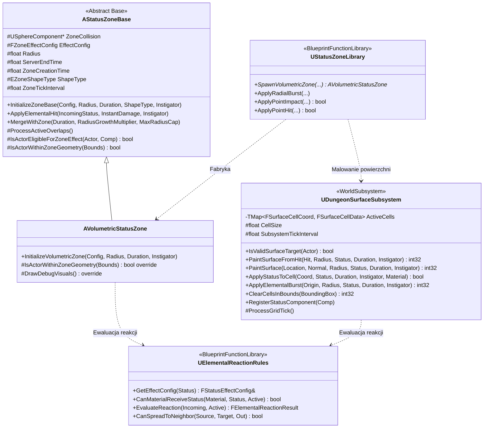
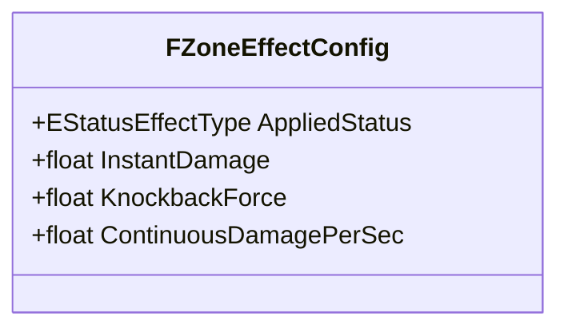

# Specyfikacja Techniczna i Projektowa: System Stref Statusów (Status Zone System)

Dokument stanowi **kompletną kartę projektowo-architektoniczną** dla modułu stref (`Status Zones`) w projekcie *Dungeon Crawler Co-op* (Unreal Engine 5.8 C++, `MYPROJECT_API`).

System realizuje dwa niezależne wektory dostarczania efektów żywiołowych do świata:
1. **Powierzchniowy (Surface)** — rzadka siatka komórek w `UDungeonSurfaceSubsystem` (WorldSubsystem), bez osobnych aktorów i dekalów.
2. **Wolumetryczny (Volumetric)** — aktor `AVolumetricStatusZone` (sfera zawieszona w przestrzeni).

Dostarczanie steruje zunifikowana fabryka `UStatusZoneLibrary`, a cała chemia żywiołowa (reakcje, materiały, propagacja) jest centralizowana w `UElementalReactionRules`.

Model sieci: **server-authoritative**, **Zero-Bandwidth Timers** (replikacja `ServerEndTime`), **Net Dormancy** (`DORM_DormantAll`).

---

## 1. Wizja i Cele Systemu

System Status Zone realizuje następujące filary:

1. **Uniwersalność Domenowa:**
   Strefa reprezentuje dowolny obszar oddziaływania na gameplay w lochu:
   - **Żywioły i Ciecze:** Ogień (`Burning`), rozlana woda (`Wet`), plama oleju (`Oiled`), prąd (`Electrified`).
   - **Gazy i Zjawiska Środowiskowe:** Trująca chmura, dym, mgła parowa (strefy wolumetryczne).
   - **Efekty Gameplayowe:** Obrażenia ciągłe (DoT), odrzut kinetyczny, reakcje łańcuchowe.

2. **Dwa Wektory Dostarczania (Surface + Volumetric):**
   - **Surface (siatka komórek):** Cienka, dyskretna warstwa przypięta do geometrii lochu (podłogi, ściany, sufity). Realizowana przez `UDungeonSurfaceSubsystem` jako rzadka siatka `TMap<FSurfaceCellCoord, FSurfaceCellData>` — **bez osobnych aktorów i dekalów**, z pełną świadomością strony fundamentu (6 kierunków) i wielostatusowością komórki.
   - **Volumetric (aktor sferyczny):** Trójwymiarowa bryła (sfera) zawieszona w przestrzeni przez czas `T`. Realizowana przez aktora `AVolumetricStatusZone`.

3. **Tryby Dostarczania (1 tryb na dany Blueprint):**
   W `AVolatileProp` wybrany jest dokładnie jeden tryb `EVolatileZoneSpawnMode`, co pozwala na precyzyjną, izolowaną weryfikację każdego wektora:
   - **RadialBurst** — pełny wybuch 3D z Line-of-Sight (obrażenia, odrzut) + obryzganie widocznych powierzchni w promieniu.
   - **PointImpact** — uderzenie punktowe w pojedynczą powierzchnię (np. rzucona butelka, ampułka).
   - **VolumetricZone** — przestrzenna bryła 3D wisząca w powietrzu (gaz, dym).

4. **Architektura Co-op i Optymalizacja Sieciowa (1–6 Graczy):**
   - **Zero-Bandwidth Timers:** Replikacja wyłącznie `ServerEndTime`. Klienci lokalnie odliczają czas.
   - **Server-Authoritative Gameplay:** Aplikacja statusów, obrażeń DoT i reakcji następuje wyłącznie na Serwerze.
   - **Net Dormancy:** Strefy wolumetryczne po utworzeniu przechodzą w `DORM_DormantAll`.

5. **Centralizacja Chemii Żywiołowej:**
   Wszystkie reguły reakcji, kompatybilności materiałowej i propagacji żyją w `UElementalReactionRules` (UBlueprintFunctionLibrary). Zarówno komponent statusów (`UStatusEffectComponent`), jak i siatka powierzchni (`UDungeonSurfaceSubsystem`) odpytują ten sam silnik zasad — brak podwójnej implementacji chemii.

---

## 2. Architektura Klas C++ (Hierarchia i Odpowiedzialności)

### Podział Odpowiedzialności:
- **`AStatusZoneBase` (`Source/MyProject/Environment/Zones/StatusZoneBase.h`):**
  Abstrakcyjny aktor strefy wolumetrycznej. Bazowy cykl życia, autorytatywny timer serwera oparty na `PrimaryActorTick.TickInterval = ZoneTickInterval` (domyślnie 0.25 s).
  Replikacja stanu w modelu Zero-Bandwidth: `EffectConfig`, `Radius`, `ServerEndTime`, `ShapeType`, `ZoneCreationTime`.
  `bReplicates = true`, `SetReplicateMovement(false)`, `NetDormancy = DORM_DormantAll`.
  Kolizja przez `USphereComponent ZoneCollision` (profil `OverlapAllDynamic`, `GenerateOverlapEvents`).
  Aplikacja statusów (`UStatusEffectComponent::ApplyStatus` u celu, wyszukiwane przez `FindComponentByClass`) oraz obrażeń DoT (`UDamageableComponent::ApplyDamage`) — wyłącznie na serwerze.
  Reakcje chemiczne (`ApplyElementalHit`) delegowane do `UElementalReactionRules::EvaluateReaction`.
  Wykrywanie nakładania się przez `ProcessActiveOverlaps()` (odpytanie `GetOverlappingActors` co interwał) oraz zdarzeniowo przez `HandleBeginOverlap`.
- **`AVolumetricStatusZone` (`Source/MyProject/Environment/Zones/Shapes/VolumetricStatusZone.h`):**
  JEDYNA klasa potomna kształtu strefy. Czysty, lekki wolumen 3D (chmury gazu, dym, mgła parowa).
  Brak dekalów, brak tablic wierzchołków — maksymalna wydajność pamięciowa i sieciowa.
  Test geometryczny AABB celu: Bounds vs środek/promień sfery (`IsActorWithinZoneGeometry`).
  Pełna obsługa Zone Merging (`MergeWithZone`): odświeżanie czasu, kontrolowane powiększanie promienia do `MaxRadiusCap`, `ForceNetUpdate()` + `ProcessActiveOverlaps()`.
- **`UDungeonSurfaceSubsystem` (`Source/MyProject/Environment/Zones/Subsystems/DungeonSurfaceSubsystem.h`):**
  Podsystem świata (`UWorldSubsystem`) zarządzający rzadką siatką komórek powierzchniowych (`TMap<FSurfaceCellCoord, FSurfaceCellData> ActiveCells`).
  Zastępuje dawny model powierzchniowych stref-aktorów z decallem — brak osobnych aktorów, brak dekalów, brak analitycznych obrysów radialnych.
  Mapowanie uderzeń cieczy/ognia na dyskretne komórki z uwzględnieniem strony fundamentu (`ESurfaceFaceDirection`: Up/Down/North/South/East/West) — rozbryzg z frontu ściany nie przenika na tył.
  Wielostatusowość komórki: do 2 statusów trzymanych inline (`TInlineAllocator<2>`), np. [Wet, Electrified].
  Ewaluacja reakcji chemicznych między żywiołami przez `UElementalReactionRules`.
  Błyskawiczne usuwanie komórek z obszaru zniszczonych fundamentów (`ClearCellsInBounds`), wywoływane przez `ADungeonStructureBase`.
  Cykliczna (0.25 s) aplikacja statusów na postacie stykające się z aktywnymi komórkami oraz wygaszanie przeterminowanych.
- **`UStatusZoneLibrary` (`Source/MyProject/Environment/Zones/Utilities/StatusZoneLibrary.h`):**
  Zunifikowana fabryka dostarczania efektów do świata:
  - `SpawnVolumetricZone`: tworzy `AVolumetricStatusZone` zawieszony w przestrzeni.
  - `ApplyRadialBurst`: natychmiastowy wybuch 3D z Line-of-Sight (obrażenia, odrzut, status) + wszechkierunkowa projekcja na powierzchnie lochu w `UDungeonSurfaceSubsystem`.
  - `ApplyInstantBurst`: alias wsteczny dla `ApplyRadialBurst`.
  - `ApplyPointImpact`: uderzenie punktowe w pojedynczą powierzchnię/cel (maluje powierzchnię w subsystemie, aplikuje obrażenia i status).
  - `ApplyPointHit`: prosty wrapper dla trafienia pojedynczym pociskiem.
- **`UElementalReactionRules` (`Source/MyProject/Environment/Elements/Utilities/ElementalReactionRules.h`):**
  Centralny silnik praw żywiołów: kompatybilność materiałowa (`CanMaterialReceiveStatus`), ewaluacja reakcji (`EvaluateReaction`), propagacja na sąsiednie komórki (`CanSpreadToNeighbor`), karty konfiguracyjne statusów (`GetEffectConfig`).
  Wspólny punkt odpytywany zarówno przez `UStatusEffectComponent` (cele/aktory), jak i `UDungeonSurfaceSubsystem` (komórki powierzchni).

---

## 3. Podsystem Siatki Powierzchniowej (Surface Grid)

`UDungeonSurfaceSubsystem` przechowuje aktywne komórki w pamięci podręcznej bez alokacji osobnych aktorów.

### 3.1. Typy Danych
- `ESurfaceFaceDirection` (`SurfaceGridTypes.h`): 6 kierunków strony fundamentu — Up, Down, North, South, East, West. Zapewnia niezależność przeciwnych stron ściany.
- `FSurfaceCellCoord`: klucz komórki — X, Y, Z + Face. Statyczne `FromWorldLocation(Location, Normal, CellSize)` (z marginesem 2 cm w głąb komórki eliminującym błędy zaokrągleń na granicy siatki), `ToWorldLocation`, `GetCoplanarNeighbors`, `GetAdjacentNeighbors` (sąsiedzi współpłaszczyznowi + krawędzie 90°), `GetTypeHash`.
- `FSurfaceCellStatusEntry`: pojedynczy aktywny status na komórce — Status, ServerEndTime, Instigator.
- `FSurfaceCellData`: dane komórki — `ActiveStatuses` (`TArray<FSurfaceCellStatusEntry, TInlineAllocator<2>>`), `SurfaceMaterial` (`EPhysicalMaterialType`), plus `HasStatus`, `FindStatus`, `RemoveStatus`, `GetDominantStatus` (do wizualizacji: Electrified > Burning > pierwszy).

### 3.2. Konfiguracja

| Parametr | Domyślnie | Opis |
| :--- | :--- | :--- |
| `CellSize` | 50.0 cm | Fizyczny rozmiar pojedynczej komórki. |
| `SubsystemTickInterval` | 0.25 s | Interwał serwera: wygaszanie komórek + aplikacja statusów na postacie. |
| `bDrawDebugGrid` | true | Debugowe rysowanie aktywnych komórek. |

### 3.3. Główne API
- `IsValidSurfaceTarget(Actor)` (static): kwalifikuje podłoże — akceptuje `ADungeonStructureBase` i geometrię poziomu (`ABrush`), odrzuca `AInteractivePropBase` i `APawn`.
- `PaintSurfaceFromHit(HitResult, Radius, Status, Duration, Instigator)`: resolver uderzenia — postać/rekwizyt (status + FloorTrace pod stopy), strefa przestrzenna (przekazanie trafienia), powierzchnia (malowanie).
- `PaintSurface(Location, Normal, Radius, Status, Duration, Instigator)`: maluje komórki w promieniu z ewaluacją reakcji.
- `ApplyStatusToCell(Coord, Status, Duration, Instigator, Material)`: atomowy punkt styku dla stanu komórki — odpytuje `UElementalReactionRules`, aplikuje wynik, zarządza `ActiveCells`.
- `ApplyElementalBurst(Origin, Radius, Status, Duration, Instigator)`: impuls sferyczny (wybuch beczki) — reakcje ze wszystkimi komórkami w zasięgu + opcjonalne malowanie posadzki.
- `ClearCellsInBounds(BoundingBox)`: usuwa komórki w AABB (zniszczenie ściany/podłogi przez `ADungeonStructureBase`).
- `RegisterStatusComponent` / `UnregisterStatusComponent`: rejestr komponentów statusów podlegających cyklicznej interakcji z podłożem.
- `OnSurfaceCellChanged` (delegat): podstawa dla systemów VFX/SFX.

---

## 4. Zunifikowana Karta Efektu (`FZoneEffectConfig`)

Pola w `FZoneEffectConfig` (`ZoneTypes.h`):

- **Status:**
  - `AppliedStatus` — nakładany status (`Burning`, `Wet`, `Oiled`, `Electrified`, `None`). Nakładany przy wejściu i odświeżany co interwał strefy.
- **Instant (dla wybuchu / trafienia):**
  - `InstantDamage` — jednorazowe obrażenia w klatce detonacji.
  - `KnockbackForce` — radialny odrzut fizyczny celów spełniających warunek LoS.
- **Continuous (dla stref trwałych):**
  - `ContinuousDamagePerSec` — ciągłe obrażenia co sekundę (np. ogień, kwas).

> **Uwaga:** strefy nie posiadają mnożnika prędkości poruszania się. Spowolnienie ruchu nie jest częścią bieżącego `FZoneEffectConfig`.

---

## 5. Reakcje Chemiczne (Elemental Reactions)

Cała chemia jest centralizowana w `UElementalReactionRules`. Reakcje zachodzą w dwóch kontekstach:
1. Na celach/aktorach — przez `UStatusEffectComponent` (powłoki na postaciach i rekwizytach).
2. Na komórkach powierzchni — przez `UDungeonSurfaceSubsystem` (siatka).

Oba konteksty odpytują ten sam silnik zasad (`EvaluateReaction`, `CanMaterialReceiveStatus`, `CanSpreadToNeighbor`).

| Istniejący Status | Przychodzący Status | Wynik Reakcji (`ReactionTag`) |
| :--- | :--- | :--- |
| Olej (`Oiled`) | Ogień (`Burning`) | `Oil_Ignition` — podpalenie, status Burning, obrażenia, odrzut, propagacja na sąsiednie komórki. |
| Ogień (`Burning`) | Woda (`Wet`) | `Steam_Extinguish` / `Fire_Extinguished` — ugaszenie, status Wet, brak DoT. |
| Woda (`Wet`) | Prąd (`Electrified`) | `Conductive_Shock` — przewodzenie, status Electrified, obrażenia szokowe. |

Dane reakcji (`FStatusReactionRule`, `FElementalReactionResult`): `bConsumeIncomingStatus`, `bRemoveExistingStatus`, `BonusInstantDamage`, `ReactionTag`, `ResultingStatus`, `bCanSpreadToNeighbor`, `ResultingDuration`.

Karty statusów (`FStatusEffectConfig` w `StatusEffectTypes.h`): `bIsLiquid`, `bRequiresFlammable`, `bRequiresConductive`, `BypassTraitsIfActive`, `DamagePerSecond`, `TickInterval`, `ReactionPriority`, `Reactions`.

---

## 6. Audyt Wydajności i Skalowalności

Scenariusz docelowy: 4 graczy w kooperacji, fala 20–30 przeciwników, dziesiątki nakładających się efektów.

### 6.1. Powierzchnia (Surface Grid) — CPU
- **Model:** Rzadka mapa `TMap<FSurfaceCellCoord, FSurfaceCellData>`. Brak osobnych aktorów, brak dekalów, brak analitycznych obrysów radialnych (48 promieni).
- **Koszt:** Co `SubsystemTickInterval` (0.25 s) iteracja wyłącznie po aktywnych komórkach (`ActiveCells`) + test styku z zarejestrowanymi komponentami statusów. Koszt proporcjonalny do liczby aktywnych komórek, nie do liczby "aktorów stref".
- **Zysk względem dawnego modelu:** Eliminacja per-aktor `GetOverlappingActors`, eliminacja GPU decal overdraw, eliminacja alokacji aktorów i dekalów przy każdym rozbryzgu.

### 6.2. Wolumetryka (Volumetric Zones) — CPU
- **Stan obecny:** Każdy `AVolumetricStatusZone` posiada `USphereComponent ZoneCollision`. Co `ZoneTickInterval` (0.25 s) `ProcessActiveOverlaps()` wywołuje `GetOverlappingActors`.
- **Rekomendacja (Wysoki Priorytet, do wdrożenia):** Zamiana odpytywania fazy szerokiej na podejście **Event-Driven** — utrzymywanie lokalnego zbioru aktorów wewnątrz strefy w oparciu o `OnComponentBeginOverlap` / `OnComponentEndOverlap` i iteracja wyłącznie po nim.
- **Rekomendacja (P2):** **Timer Phase Staggering** — losowe przesunięcie pierwszej fazy ticka (`FMath::FRandRange`) rozkładające obciążenie wielu stref pomiędzy klatki.
- **Rekomendacja (P2):** **LoS Caching** — pamięć podręczna widoczności per aktor, odświeżana tylko przy ruchu > 30 cm.

### 6.3. Skalowalność Sieciowa i Przepustowość (Network Bandwidth)
- **Ocena:** Implementacja jest oszczędna:
  - Strefy wolumetryczne: `bReplicates = true`, `bReplicateMovement = false`, `NetDormancy = DORM_DormantAll`. Replikowane wyłącznie `EffectConfig`, `Radius`, `ServerEndTime`, `ShapeType`, `ZoneCreationTime`.
  - Siatka powierzchni: nie replikuje aktorów — stan komórek jest autorytatywny na serwerze; klienci odbierają efekty przez komponenty statusów i delegaty.
  - Obrażenia i logika statusów są w 100% autorytatywne na serwerze (zero RPC do klientów podczas trwania efektu).

---

## 7. Roadmapa Optymalizacyjna

| Priorytet | Zadanie | Status | Cel / Zysk |
| :---: | :--- | :---: | :--- |
| **P1** | **Surface Grid (`UDungeonSurfaceSubsystem`)** | **[ZREALIZOWANE]** | Zastąpienie stref-aktorów z decallem rzadką siatką komórek. Zero per-aktor overlaps, zero decal overdraw. |
| **P1** | **Net Dormancy stref wolumetrycznych** | **[ZREALIZOWANE]** | `DORM_DormantAll` po utworzeniu — wyłączenie z pętli porównywania właściwości. |
| **P1** | **Zone Merging (strefy wolumetryczne)** | **[ZREALIZOWANE]** | `MergeWithZone` — odświeżanie czasu i kontrolowane powiększanie promienia zamiast duplikatów. |
| **P1** | **Event-Driven Overlap (strefy wolumetryczne)** | Do wdrożenia | Zamiana `GetOverlappingActors()` na zbiór w oparciu o `OnComponentBegin/EndOverlap`. |
| **P2** | **Timer Phase Staggering** | Do wdrożenia | Losowe mikro-przesunięcie fazy ticka strefy eliminujące mikro-przycięcia. |
| **P2** | **LoS Caching** | Do wdrożenia | Pamięć podręczna widoczności per aktor odświeżana tylko przy ruchu > 30 cm. |
