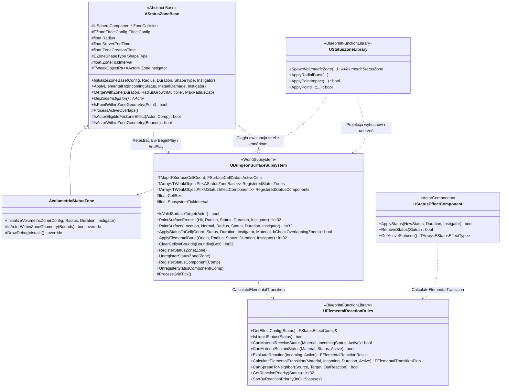
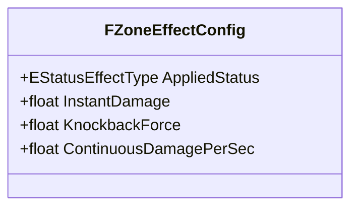

# Specyfikacja Techniczna i Projektowa: System Stref Statusów (Status Zone System)

Dokument stanowi **kompletną kartę projektowo-architektoniczną** dla modułu stref (`Status Zones`) oraz siatki powierzchniowej (`Surface Grid`) w projekcie *Dungeon Crawler Co-op* (Unreal Engine 5.8 C++, `MYPROJECT_API`).

System realizuje dwa zintegrowane wektory dostarczania efektów żywiołowych do świata:
1. **Powierzchniowy (Surface Grid)** — rzadka siatka komórek w `UDungeonSurfaceSubsystem` (WorldSubsystem), przypięta do geometrii lochu (posadzki, ściany, sufity).
2. **Wolumetryczny (Volumetric Zone)** — trójwymiarowa strefa przestrzenna `AVolumetricStatusZone` (sfera lub chmura zawieszona w powietrzu).

Dostarczaniem efektów zarządza zunifikowana fabryka `UStatusZoneLibrary`, a cała chemia żywiołowa (reakcje, kompatybilność materiałowa, rozprzestrzenianie, wygaszanie) jest scentralizowana w `UElementalReactionRules` jako **Jedynym Źródle Prawdy (Single Source of Truth)**.

Model sieciowy: **Server-Authoritative**, **Zero-Bandwidth Timers** (replikacja `ServerEndTime`), **Net Dormancy** (`DORM_DormantAll`).

---

## 1. Wizja i Cele Systemu

1. **Uniwersalność Domenowa:**
   Strefa reprezentuje dowolny obszar oddziaływania na rozgrywkę w lochu:
   - **Żywioły i Ciecze:** Ogień (`Burning`), rozlana woda (`Wet`), plama oleju (`Oiled`), prąd (`Electrified`).
   - **Zjawiska Środowiskowe:** Trująca chmura, dym, mgła parowa, strefy ciszy (strefy wolumetryczne).
   - **Mechaniki Rozgrywki:** Obrażenia ciągłe (DoT), odrzut kinetyczny (Knockback), reakcje łańcuchowe i propagacja.

2. **Dwa Zintegrowane Wektory Dostarczania:**
   - **Surface Grid (Siatka Powierzchniowa):** Cienka, dyskretna warstwa przypięta do geometrii lochu (posadzki, ściany, sufity). Realizowana przez `UDungeonSurfaceSubsystem` jako rzadka mapa `TMap<FSurfaceCellCoord, FSurfaceCellData>`, z pełną świadomością strony fundamentu (6 kierunków w 3D) oraz wielostatusowością komórek.
   - **Volumetric Zone (Strefa Wolumetryczna):** Trójwymiarowa bryła zawieszona w przestrzeni lub poruszająca się (np. aura postaci, pocisk, wędrująca chmura gazu). Realizowana przez aktora `AVolumetricStatusZone`.

3. **Ciągła Dwukierunkowa Integracja (Surface $\leftrightarrow$ Volumetric):**
   - Strefy wolumetryczne w `BeginPlay` rejestrują się w `UDungeonSurfaceSubsystem`, a w `EndPlay` wyrejestrowują.
   - Wylanie płynu na podłoże pod wiszącą strefą (np. rzucenie oleju w chmurę prądu) wywołuje natychmiastową reakcję w tej samej klatce (`bCheckOverlappingZones`).
   - Pętla serwera `UDungeonSurfaceSubsystem::ProcessGridTick` (0.25 s) nieustannie ewaluuje aktywne strefy przestrzenne z komórkami posadzki pod nimi, obsługując ruchome strefy i aury.

4. **Tryby Dostarczania Efektów (`EVolatileZoneSpawnMode`):**
   W obiektach wybuchowych i miotanych (`AVolatileProp`) stosowany jest dedykowany tryb dostarczenia:
   - **RadialBurst** — natychmiastowy wybuch 3D z Line-of-Sight (obrażenia, odrzut kinetyczny) oraz wszechkierunkowa projekcja na powierzchnie lochu.
   - **PointImpact** — uderzenie punktowe w pojedynczą powierzchnię lub cel (np. rzucona butelka z cieczą).
   - **VolumetricZone** — trwała strefa przestrzenna zawieszona w powietrzu (np. chmura gazu, burza elektryczna).

5. **Architektura Co-op i Optymalizacja Sieciowa (1–6 Graczy):**
   - **Zero-Bandwidth Timers:** Replikacja wyłącznie `ServerEndTime`. Klienci lokalnie odliczają upływ czasu.
   - **Server-Authoritative Gameplay:** Aplikacja statusów, obrażeń i reakcji zachodzi w 100% na serwerze.
   - **Net Dormancy:** Strefy wolumetryczne po utworzeniu natychmiast przechodzą w `DORM_DormantAll`.

6. **Centralizacja Praw Żywiołów (Single Source of Truth):**
   Wszelkie reguły chemiczne, kompatybilność fizyczna materiałów, wypieranie płynów i czyszczenie osieroconych statusów są zaimplementowane w `UElementalReactionRules::CalculateElementalTransition`. Zarówno komponenty aktorów (`UStatusEffectComponent`), jak i komórki posadzki (`UDungeonSurfaceSubsystem`) korzystają z tego samego silnika.

---

## 2. Architektura Klas C++



### Podział Odpowiedzialności Klas:

- **`AStatusZoneBase` (`Source/MyProject/Environment/Zones/StatusZoneBase.h`):**
  Abstrakcyjny aktor bazowy dla stref przestrzennych. Zarządza autorytatywnym cyklem życia serwera, replikacją w modelu Zero-Bandwidth (`DORM_DormantAll`, `ServerEndTime`), kolizją (`USphereComponent ZoneCollision`), aplikacją statusów na wchodzących aktorów oraz rejestracją w `UDungeonSurfaceSubsystem`. Udostępnia polimorficzny test punktowy `IsPointWithinZoneGeometry(Point)`.

- **`AVolumetricStatusZone` (`Source/MyProject/Environment/Zones/Shapes/VolumetricStatusZone.h`):**
  Implementacja przestrzennej bryły sferycznej (chmury gazu, kule energii, mgła). Obsługuje scalanie nakładających się stref tego samego żywiołu (`MergeWithZone`) oraz rzutowanie geometrii na cele i podłoże.

- **`UDungeonSurfaceSubsystem` (`Source/MyProject/Environment/Zones/Subsystems/DungeonSurfaceSubsystem.h`):**
  Podsystem świata (`UWorldSubsystem`) zarządzający rzadką siatką komórek powierzchniowych (`ActiveCells`). Odpowiada za:
  - Dyskretną projekcję 3D uderzeń i wybuchów na ściany, sufity i podłogi z uwzględnieniem strony fundamentu (`ESurfaceFaceDirection`).
  - Atomową aplikację statusów przez `ApplyStatusToCell` z automatyczną natychmiastową reakcją z wiszącymi strefami (`bCheckOverlappingZones`).
  - Cykliczną pętlę serwera `ProcessGridTick` (0.25 s): wygaszanie statusów, czyszczenie osieroconych ładunków, propagację żywiołów (Cellular Automata), interakcję z aktorami oraz ciągłą ewaluację z zarejestrowanymi strefami `RegisteredStatusZones`.
  - Błyskawiczne czyszczenie komórek ze zniszczonych struktur (`ClearCellsInBounds`).

- **`UStatusZoneLibrary` (`Source/MyProject/Environment/Zones/Utilities/StatusZoneLibrary.h`):**
  Statyczna fabryka operacji obszarowych: `SpawnVolumetricZone`, `ApplyRadialBurst`, `ApplyPointImpact`, `ApplyPointHit`.

- **`UElementalReactionRules` (`Source/MyProject/Environment/Elements/Utilities/ElementalReactionRules.h`):**
  Główny silnik praw żywiołów świata gry. Udostępnia funkcję `CalculateElementalTransition`, która stanowi unikalne źródło prawdy dla wszystkich zmian chemiczno-fizycznych w projekcie.

---

## 3. Podsystem Siatki Powierzchniowej (Surface Grid)

`UDungeonSurfaceSubsystem` przechowuje wyłącznie komórki posiadające aktywny status (`ActiveCells`). Puste fragmenty geometrii lochu nie generują żadnego narzutu pamięciowego.

### 3.1. Typy Danych (`SurfaceGridTypes.h`)
- `ESurfaceFaceDirection` — 6 kierunków normalnej fundamentu: `Up` (posadzka), `Down` (sufit), `North`, `South`, `East`, `West` (ściany pionowe). Zapewnia niezależność przeciwnych stron ścian.
- `FSurfaceCellCoord` — trójwymiarowy klucz siatki: `(X, Y, Z, Face)`. Posiada metody mapowania `FromWorldLocation` (z 2 cm marginesem w głąb kafelka), `ToWorldLocation`, `GetCoplanarNeighbors` oraz `GetAdjacentNeighbors` (w tym krawędzie 90°).
- `FSurfaceCellStatusEntry` — pojedynczy status aktywny na komórce: `Status`, `ServerEndTime`, `Instigator`.
- `FSurfaceCellData` — kontener komórki: lista statusów `ActiveStatuses` (`TArray<FSurfaceCellStatusEntry, TInlineAllocator<2>>`), tożsamość materiału `SurfaceMaterial` (`EPhysicalMaterialType`), metody pomocnicze (`HasStatus`, `FindStatus`, `RemoveStatus`, `GetDominantStatus`).

### 3.2. Konfiguracja Subsystemu

| Parametr | Domyślnie | Opis |
| :--- | :--- | :--- |
| `CellSize` | 50.0 cm | Dyskretny rozmiar boku pojedynczej komórki siatki. |
| `SubsystemTickInterval` | 0.25 s | Okres pętli serwera: wygaszanie, propagacja, interakcja z aktorami i strefami. |
| `bDrawDebugGrid` | true | Serwerowe renderowanie wizualizacji aktywnych komórek w trybach debugowych. |

### 3.3. Atomowy Punkt Styku: `ApplyStatusToCell`

Wszelkie zmiany stanu komórki (niezależnie czy wywołane wybuchem, pociskiem, propagacją, strefą czy wejściem postaci) przechodzą przez pojedynczą funkcję `ApplyStatusToCell`:
1. Pobiera obecną tożsamość materiałową podłoża (`ExplicitMaterial` lub trace w głąb architektury).
2. Wywołuje `UElementalReactionRules::CalculateElementalTransition`.
3. Usuwa statusy wygaszone/skonsumowane/wyparte (`Plan.StatusesToRemove`).
4. Dodaje lub odświeża statusy wynikowe (`Plan.StatusesToApply`).
5. **Natychmiastowa ewaluacja stref (`bCheckOverlappingZones`):** Jeśli komórka znajduje się pod zarejestrowaną strefą wolumetryczną (np. świeży olej wylany pod chmurę prądu), funkcja natychmiast aplikuje żywioł strefy z flagą `bCheckOverlappingZones = false` (zabezpieczenie przed pętlą rekurencyjną).
6. Rozgłasza delegat `OnSurfaceCellChanged` dla efektów wizualnych i dźwiękowych.

---

## 4. Zunifikowana Karta Efektu (`FZoneEffectConfig`)



Pola w strukturze `FZoneEffectConfig` (`ZoneTypes.h`):
- **AppliedStatus** — nakładany status żywiołowy (`Burning`, `Wet`, `Oiled`, `Electrified`, `None`).
- **InstantDamage** — jednorazowe obrażenia w momencie wybuchu lub trafienia.
- **KnockbackForce** — siła radialnego odrzutu fizycznego celów w linii wzroku (LoS).
- **ContinuousDamagePerSec** — ciągłe obrażenia zadawane celom przebywającym w strefie co sekundę.

---

## 5. Centralny Silnik Chemii Żywiołów (`UElementalReactionRules`)

Wszelkie decyzje o reakcjach chemicznych, kompatybilności materiałowej i wygaszaniu statusów podejmuje funkcja `CalculateElementalTransition`:

```cpp
FElementalTransitionPlan UElementalReactionRules::CalculateElementalTransition(
    EPhysicalMaterialType TargetMaterial,
    EStatusEffectType IncomingStatus,
    float IncomingDuration,
    const TArray<EStatusEffectType>& CurrentActiveStatuses);
```

### 5.1. Różnica Pomiędzy `CanMaterialReceiveStatus` a `CanMaterialSustainStatus`

W systemie obowiązuje ścisłe fizyczne rozróżnienie pomiędzy **przyjęciem nowego statusu** a **podtrzymaniem statusu już aktywnego**:

- **`CanMaterialReceiveStatus` (Walidacja Nowego Statusu):**
  Określa, czy materiał może zostać zainfekowany nowym żywiołem:
  - Płyny (`Wet`, `Oiled`) mogą pokryć dowolny materiał.
  - Ogień (`Burning`) wymaga materiału łatwopalnego (`bFlammable == true`, np. drewno, ciało) LUB obecności łatwopalnego nośnika na celu (`ActiveStatuses.Contains(Oiled)`). Suchy kamień **nie przyjmie** ognia od pochodni.
  - Prąd (`Electrified`) wymaga materiału przewodzącego (`bConductive == true`, np. metal, ciało) LUB obecności cieczy przewodzącej (`ActiveStatuses.Contains(Wet)`). Suchy kamień **nie przyjmie** ładunku elektrycznego.

- **`CanMaterialSustainStatus` (Podtrzymanie Statusu Aktywnego):**
  Określa, czy dany status może nadal istnieć na materiale po usunięciu innego statusu:
  - Ogień (`Burning`): jest procesem **samopodtrzymującego się spalania paliwa**. Gdy olej na kamieniu ulegnie zapłonowi, olej zostaje skonsumowany (`StatusesToRemove.Add(Oiled)`), ale powstały płomień podtrzymuje się na kamieniu przez pełen czas spalania (`ResultingDuration = 6.0s`). Ogień na kamieniu **nigdy nie jest traktowany jako osierocony** — gaśnie wyłącznie po upływie czasu lub po zalaniu wodą.
  - Prąd (`Electrified`): jest zjawiskiem **pasożytniczego przepływu ładunku**. Na izolatorach (suchy kamień) prąd nie ma paliwa i wymaga ciągłej obecności wody (`Wet`). Gdy woda odparuje lub zostanie wyparta, prąd na kamieniu natychmiast ulega rozproszeniu (jest osierocony).

### 5.2. Fazy Ewaluacji w `CalculateElementalTransition`

1. **Odświeżenie:** Jeśli `IncomingStatus` jest już obecny na celu, zwracany jest plan z odświeżonym czasem trwania.
2. **Ewaluacja Reakcji (`EvaluateReaction`):**
   - **Dedykowana Reakcja:** Sprawdzenie reguł z karty przychodzącego żywiołu (np. `Oil_Electric_Ignition`). Jeśli reakcja wygenerowała `ResultingStatus` (np. `Burning`), jest on dodawany do planu, o ile materiał może go podtrzymać (`CanMaterialSustainStatus`).
   - **Wypieranie Płynów (Liquid Displacement):** Każdy nowy płyn (`bIsLiquid`) wypiera obecny na powierzchni płyn (np. woda zmywa olej, olej wypiera wodę).
   - **Brak Reakcji:** Weryfikacja kompatybilności materiałowej przez `CanMaterialReceiveStatus`.
3. **Czyszczenie Osieroconych Statusów Pasożytniczych:**
   Uruchamiane **wyłącznie wtedy**, gdy w bieżącej transformacji faktycznie usunięto jakiś status nośnika (`!Plan.StatusesToRemove.IsEmpty()`). Weryfikuje pozostałe statusy za pomocą `CanMaterialSustainStatus`.

### 5.3. Matryca Reakcji Żywiołowych

| Istniejący Status | Przychodzący Status | Tag Reakcji (`ReactionTag`) | Skutek Fizyczno-Chemiczny |
| :--- | :--- | :--- | :--- |
| Olej (`Oiled`) | Ogień (`Burning`) | `Oil_Ignition` | Zapłon plamy oleju: olej staje się paliwem podtrzymującym płomień `[Oiled, Burning]`. Czas trwania ognia synchronizuje się z pozostałym czasem oleju (`bSyncWithCarrierDuration`), obrażenia, propagacja ognia na sąsiednie komórki. |
| Olej (`Oiled`) | Prąd (`Electrified`) | `Oil_Electric_Ignition` | Iskra elektryczna detonuje plamę oleju: zapłon paliwa `[Oiled, Burning]`, synchronizacja czasu z nośnikiem (`bSyncWithCarrierDuration`), obrażenia, propagacja ognia na sąsiednie komórki. |
| Ogień (`Burning`) | Woda (`Wet`) | `Steam_Extinguish` | Ugaszenie ognia: usunięcie `Burning`, odparowanie wody (para wodna), brak DoT. |
| Woda (`Wet`) | Prąd (`Electrified`) | `Conductive_Shock` | Przewodzenie: koegzystencja obu statusów `[Wet, Electrified]`, obrażenia szokowe, propagacja prądu po całej kałuży. Czas trwania prądu na izolatorach jest ograniczony do czasu obecności wody. |
| Płyn A (`Wet` / `Oiled`) | Płyn B (`Oiled` / `Wet`) | `Liquid_Displaced` | Wypieranie powłoki płynnej: nowy płyn bezwzględnie zmywa obecny płyn na powierzchni, zajmując jego miejsce (Liquid Mutual Exclusivity). |

### 5.4. Dynamiczna Synchronizacja Nośnika (Carrier Duration Synchronization)

System realizuje uniwersalny mechanizm nośników (`DoesStatusSyncWithCarrier`, `bSyncWithCarrierDuration`):
1. **Wektor Zależny $\rightarrow$ Nośnik (Inherit):**
   Gdy status zależny (np. `Burning` na kamieniu lub `Electrified` na kamieniu) jest nakładany na cel posiadający aktywny nośnik (`Oiled` lub `Wet`), jego czas trwania jest wyliczany funkcją `ComputeAdjustedDuration` i synchronizowany z pozostałym czasem paliwa/nośnika.
2. **Wektor Nośnik $\rightarrow$ Zależny (Extend / Forward Sync):**
   Gdy do celu posiadającego już aktywny status zależny (np. płonąca posadzka lub naelektryzowany wróg) zostanie dodany nowy nośnik (np. wylanie butli oleju 30s na palący się kamień lub oblanie wodą naelektryzowanego wroga), funkcje `SyncDependentsWithCarrier` (dla siatki) i `SyncDependentStatusesWithCarrier` (dla komponentu aktora) automatycznie wydłużają czas trwania statusów zależnych do nowego czasu życia nośnika.
3. **Zasada Wyłączności Cieczy (Liquid Mutual Exclusivity):**
   Zunifikowana w metodach `EnforceLiquidMutualExclusivity` / `DisplaceOtherLiquids`. Nałożenie cieczy usuwa wszelkie inne ciecze i wygasza osierocone przez nie ładunki.

---

## 6. Wydajność i Skalowalność

Układ zaprojektowano pod kątem stabilnych 60 FPS w sesjach kooperacyjnych (1–6 graczy, dziesiątki wrogów, intensywne reakcje żywiołowe):

1. **Siatka Powierzchniowa (Surface Grid):**
   - Rzadka mapa `TMap` przechowuje wyłącznie aktywne komórki.
   - Pętla serwera `ProcessGridTick` (0.25 s) iteruje tylko po kafelkach posiadających aktywny status.
   - Brak alokacji dodatkowych aktorów przy rozlewaniu cieczy na podłodze i ścianach.

2. **Strefy Wolumetryczne (Volumetric Zones):**
   - Po utworzeniu natychmiast przechodzą w stan uśpienia sieciowego `DORM_DormantAll`.
   - Replikacja oparta o stały czas zakończenia `ServerEndTime` (Zero-Bandwidth).
   - Zone Merging (`MergeWithZone`) zapobiega mnożeniu instancji stref tego samego żywiołu w tym samym miejscu.

3. **Komponent Statusów Aktorów (`UStatusEffectComponent`):**
   - Modułowa architektura oparta na wyodrębnionych funkcjach pomocniczych (`ComputeAdjustedDuration`, `DisplaceOtherLiquids`, `SyncDependentStatusesWithCarrier`, `UpsertStatus`).
   - Linearny przebieg `ApplyStatus` bez zduplikowanych pętli i if-ologii.
   - Zero-Tick Idle: komponent wyłącza swój tick, gdy brak aktywnych statusów.

4. **Bezpieczeństwo Wywołań i Brak Zapętleń:**
   - Flaga `bCheckOverlappingZones = false` w podrzędnych wywołaniach `ApplyStatusToCell` gwarantuje maksymalną głębokość stosu równą 1 przy natychmiastowych reakcjach cieczy ze strefami.
   - W pętli `ProcessGridTick` modyfikowane koordynaty są buforowane w lokalnej tablicy `CellsToAffect` przed aplikacją, co zapobiega modyfikacji kontenera w trakcie iteracji.

---

## 7. Roadmapa Rozwoju

| Zadanie | Status | Opis i Cel |
| :--- | :---: | :--- |
| **Surface Grid Subsystem (`UDungeonSurfaceSubsystem`)** | **[ZREALIZOWANE]** | Rzadka siatka komórek 3D na posadzkach i ścianach z obsługą 6 kierunków ścian. |
| **Single Source of Truth (`CalculateElementalTransition`)** | **[ZREALIZOWANE]** | Centralizacja logiki chemicznej, wypierania płynów i czyszczenia statusów w jednej funkcji. |
| **Rozróżnienie Receive vs Sustain (`CanMaterialSustainStatus`)** | **[ZREALIZOWANE]** | Płomień po spaleniu oleju trwa przez pełny czas spalania paliwa na posadzce; prąd zanika bez wody. |
| **Ciągła Integracja Stref z Siatką (`RegisteredStatusZones`)** | **[ZREALIZOWANE]** | Automatyczna rejestracja stref wolumetrycznych w subsystemie; natychmiastowy zapłon plam pod chmurami oraz obsługa ruchomych stref i aur. |
| **Dwukierunkowa Synchronizacja Nośników (`bSyncWithCarrierDuration`)** | **[ZREALIZOWANE]** | Spójna synchronizacja czasów paliwa i nośnika w siatce oraz aktorach (`SyncDependentStatusesWithCarrier`). |
| **Refaktoryzacja i Eliminacja Duplikacji Logiki** | **[ZREALIZOWANE]** | Uproszczenie `ElementalReactionRules.cpp` i `StatusEffectComponent.cpp` do spójnych funkcji pomocniczych (`ComputeAdjustedDuration`, `DisplaceOtherLiquids`, `UpsertStatus`). |
| **Event-Driven Overlap dla Stref Wolumetrycznych** | Planowane | Zastąpienie periodycznego `GetOverlappingActors` lokalnym zbiorem aktorów w oparciu o delegaty Begin/EndOverlap. |
| **Timer Phase Staggering** | Planowane | Losowe mikro-przesunięcie fazy pierwszego ticka strefy eliminujące skoki obciążenia w pojedynczych klatkach serwera. |
| **LoS Caching dla Promieni Wybuchu** | Planowane | Pamięć podręczna widoczności celów odświeżana tylko przy przemieszczeniu celu o więcej niż 30 cm. |
