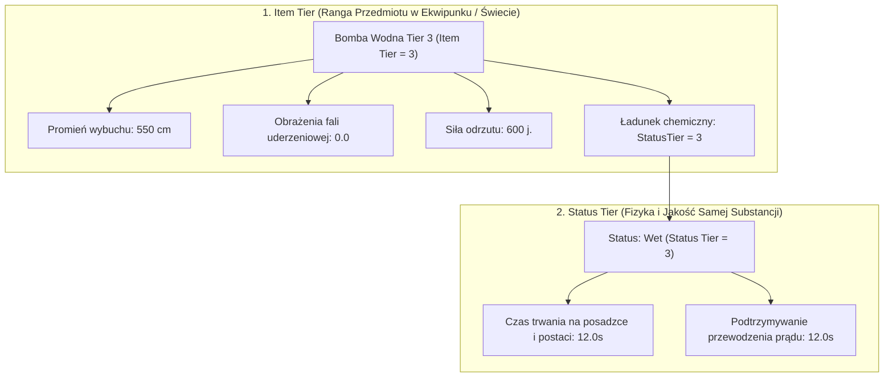

# Specyfikacja Architektoniczna: System Tierów Przedmiotów Miotanych i Rekwizytów (Data-Driven Volatile Props & Item Tiers)

> **Status:** Zaplanowane do przyszłej implementacji (Future Implementation)  
> **Moduł:** `VolatileProp` / `StatusZones` / `Inventory & Tooltips`  
> **Zasada naczelna:** Data-Driven Architecture — oddzielenie czystych danych balansu i ekwipunku od aktorów 3D.

---

## 1. Geneza i Problem do Rozwiązania

W dotychczasowej implementacji parametry niestabilnych rekwizytów i bomb (`AVolatileProp`) były konfigurowane bezpośrednio w zmiennych Blueprintów (`BP_Bomb_Water`, `BP_Bomb_Oil`, `BP_ExplosiveBarrel` itp.):
* `EffectRadius`
* `InstantDamage`
* `KnockbackForce`
* `ZoneDuration`
* `ZoneEffectConfig.StatusTier`

### Zagrożenia architektury hardcodowanej w Blueprintach:
1. **Eksplozja liczby assetów:** Dla 4 tierów każdego typu bomby (Woda, Olej, Ogień, Prąd, Odrzut) powstaje 20–30 osobnych Blueprintów.
2. **Utrudniony balans:** Zmiana skalowania promienia o 10% wymaga ręcznego otwierania i edycji kilkunastu Blueprintów.
3. **Ryzyko utraty danych:** Przypadkowe zresetowanie lub usunięcie Blueprinta bezpowrotnie niszczy wycyzelowane wartości liczbowe balansu.
4. **Brak wsparcia dla Ekwipunku i UI:** System ekwipunku, skrzynie z łupem (loot tables) i okienka podpowiedzi (tooltips) **nie mogą spawnować fizycznego aktora 3D** w świecie tylko po to, by odczytać jego nazwę, ikonę, promień i czas trwania.

---

## 2. Podział Odpowiedzialności: `Item Tier` vs `Status Tier`

W dojrzałym systemie RPG / Immersive Sim obowiązuje precyzyjny podział pomiędzy rangą przedmiotu w ręku gracza a zachowaniem żywiołu w świecie gry:



### 1. `Item Tier` (Poziom Przedmiotu):
* Definiuje fizyczne parametry wybuchu flakonu / bomby:
  * `EffectRadius` — zasięg rażenia fali uderzeniowej i rozbryzgu,
  * `InstantDamage` — obrażenia natychmiastowe fali (np. dla bomb odłamkowych),
  * `KnockbackForce` — impuls fizyczny odrzucający postacie i propy,
  * `StatusTier` — jakość substancji zamkniętej we flakonie (np. Tier 3).

### 2. `Status Tier` (Poziom Żywiołu):
* Definiuje zachowanie substancji po uwolnieniu do świata (w `FStatusEffectTier`):
  * `BaseDuration` — jak długo plama leży na podłodze i jak długo postać jest mokra/naoliwiona,
  * `DamagePerSecond` — obrażenia DoT na sekundę (dla ognia i prądu),
  * `TickInterval` — interwał tykania obrażeń.

---

## 3. Docelowa Architektura Danych (`DataAsset`)

Zamiast twardych zmiennych w `AVolatileProp`, wprowadzamy `UPrimaryDataAsset`:

### 3.1. Struktura Pojedynczego Tieru (`FVolatilePropTierDefinition`)
```cpp
USTRUCT(BlueprintType)
struct FVolatilePropTierDefinition
{
    GENERATED_BODY()

    /** Wyświetlana nazwa rangi (np. "Zwykły Flakon Wody", "Mocna Bomba Wodna") */
    UPROPERTY(EditAnywhere, BlueprintReadOnly, Category = "Config")
    FText TierDisplayName;

    /** Promień sfery eksplozji / rozbryzgu w cm */
    UPROPERTY(EditAnywhere, BlueprintReadOnly, Category = "Config", meta = (ClampMin = "50.0"))
    float EffectRadius = 400.0f;

    /** Jednorazowe obrażenia natychmiastowe fali wybuchu */
    UPROPERTY(EditAnywhere, BlueprintReadOnly, Category = "Config")
    float InstantDamage = 0.0f;

    /** Siła odrzutu kinetycznego */
    UPROPERTY(EditAnywhere, BlueprintReadOnly, Category = "Config")
    float KnockbackForce = 0.0f;

    /** Poziom (Tier) aplikowanego statusu żywiołowego przekazywany do chemii */
    UPROPERTY(EditAnywhere, BlueprintReadOnly, Category = "Config")
    uint8 StatusTier = 1;

    /** Opcjonalny narzut na czas trwania strefy (-1.0f = użyj kanonicznego czasu z StatusTier) */
    UPROPERTY(EditAnywhere, BlueprintReadOnly, Category = "Config")
    float OverrideZoneDuration = -1.0f;
};
```

### 3.2. DataAsset Rodziny Rekwizytów (`UVolatilePropConfigAsset`)
```cpp
UCLASS(BlueprintType)
class MYPROJECT_API UVolatilePropConfigAsset : public UPrimaryDataAsset
{
    GENERATED_BODY()

public:
    /** Identyfikator techniczny rodziny (np. "Prop.Flask.Water", "Prop.Bomb.Oil") */
    UPROPERTY(EditAnywhere, BlueprintReadOnly, Category = "Item")
    FPrimaryAssetId PropId;

    /** Typ żywiołu dostarczanego przez ten rekwizyt */
    UPROPERTY(EditAnywhere, BlueprintReadOnly, Category = "Elemental")
    EStatusEffectType ElementalStatus = EStatusEffectType::None;

    /** Tryb powstania strefy (RadialBurst, PointImpact, VolumetricZone) */
    UPROPERTY(EditAnywhere, BlueprintReadOnly, Category = "Zone")
    EVolatileZoneSpawnMode ZoneSpawnMode = EVolatileZoneSpawnMode::RadialBurst;

    /** Tabela konfiguracji dla poszczególnych tierów (np. 1, 2, 3, 4) */
    UPROPERTY(EditAnywhere, BlueprintReadOnly, Category = "Tiers")
    TMap<uint8, FVolatilePropTierDefinition> TierConfigs;

    /** Wizualia wspólne lub per-tier */
    UPROPERTY(EditAnywhere, BlueprintReadOnly, Category = "Visuals")
    TSoftObjectPtr<UTexture2D> ItemIcon;

    UPROPERTY(EditAnywhere, BlueprintReadOnly, Category = "Visuals")
    TSoftObjectPtr<UStaticMesh> WorldMesh;

    /** Bezpieczny getter konfiguracji dla zadanego tieru */
    const FVolatilePropTierDefinition* GetTierConfig(uint8 Tier) const
    {
        if (const FVolatilePropTierDefinition* Found = TierConfigs.Find(Tier))
        {
            return Found;
        }
        // Fallback na Tier 1 lub pierwszy dostępny
        if (TierConfigs.Num() > 0)
        {
            return &TierConfigs.CreateConstIterator().Value();
        }
        return nullptr;
    }
};
```

---

## 4. Odchudzenie Aktora `AVolatileProp`

Aktor fizyczny w świecie gry staje się uniwersalną powłoką wykonawczą. Zamiast kilkunastu zmiennych posiada jedynie:

```cpp
// W AVolatileProp.h:

/** Plik danych definicji tego typu bomby / rekwizytu (np. DA_WaterBomb) */
UPROPERTY(EditAnywhere, BlueprintReadOnly, Category = "Custom|Config")
TObjectPtr<UVolatilePropConfigAsset> PropConfig;

/** Wybrany poziom przedmiotu (Item Tier: 1..4) dla tej instancji w świecie lub po zespawnowaniu */
UPROPERTY(EditAnywhere, BlueprintReadOnly, Category = "Custom|Config", meta = (ClampMin = "1", ClampMax = "10"))
uint8 ItemTier = 1;
```

W `BeginPlay` lub `OnConstruction`:
Aktor odpytuje `PropConfig->GetTierConfig(ItemTier)` i w ułamku mikrosekundy konfiguruje swój `EffectRadius`, `ZoneEffectConfig` oraz mesha.

---

## 5. Korzyści dla UI, Ekwipunku i Balansu

1. **Błyskawiczne Tooltipy w UI:**
   Ekwipunek gracza przechowuje strukturę `FInventoryItem { FPrimaryAssetId PropId, uint8 ItemTier }`. Po najechaniu myszką UI bez spawnowania aktora odpytuje `UVolatilePropConfigAsset` i wyświetla:
   > **Mocna Bomba Wodna (Tier 3)**  
   > *Zasięg wybuchu: 5.5 m*  
   > *Efekt: Zalanie wodą (Tier 3 — 12 sekund)*  
   > *Waga: 1.5 kg*
2. **Centralny balans alchemii:**
   Wszystkie flakony wody (od Tieru 1 do 4) edytuje się w **jednym pliku** `DA_WaterFlask.uasset`.
3. **Bezpieczeństwo danych:**
   Wartości balansu są odseparowane od logiki graficznej i fizycznej Blueprintów mapy.
